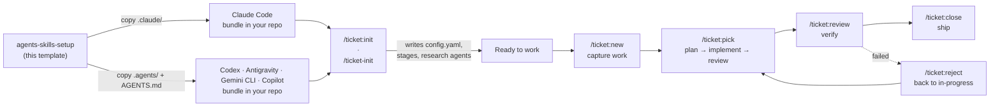

A **template** for wiring an agentic coding assistant into your project. Use this
repo as a starting point — copy one of its two self-contained bundles into your
own project, customize it, and you get a complete, backend-agnostic **ticket
workflow** plus a handful of auto-triggered **authoring and review agents**.

Everything here is prompt-and-config only: no runtime, no dependencies, no build
step. The commands, skills, and agents are Markdown instructions the assistant
loads on demand and executes with its own tools.

**📖 [Full documentation](https://elmoritz.github.io/agents-skills-setup/)** —
every command, skill, and review agent, each with a diagram of how it actually
moves through its steps and gates. This README stays high-level; that site is
the detailed reference.

> **This is a template, not a library.** Don't depend on it — fork it, copy it,
> and edit the copied bundle to fit your project. The setup is meant to be
> shaped: rename stages, adjust ticket types, and — most importantly — set up the
> **research agents** your project's ticket creation needs. Init guides you
> through that (see below); thinking about your sources beforehand makes its
> questions easy to answer.

## Two bundles, five assistants

The repo ships **two parallel, functionally-equal bundles**. Pick the one that
matches your assistant — each is fully self-contained, and you only copy one.

| Assistant | Bundle | Commands look like | Config path |
| --- | --- | --- | --- |
| **Claude Code** | [`.claude/`](.claude/) | `/ticket:new` | `.claude/config.yaml` |
| **OpenAI Codex** | [`.agents/`](.agents/) + [`AGENTS.md`](AGENTS.md) | `$ticket-new` | `.agents/config.yaml` |
| **Google Antigravity** | [`.agents/`](.agents/) + [`AGENTS.md`](AGENTS.md) | `/ticket-new` | `.agents/config.yaml` |
| **Gemini CLI** | [`.agents/`](.agents/) + [`AGENTS.md`](AGENTS.md) | `/ticket-new` | `.agents/config.yaml` |
| **GitHub Copilot** | [`.agents/`](.agents/) + [`AGENTS.md`](AGENTS.md) | `/ticket-new` | `.agents/config.yaml` |

Why one bundle covers four of them: `.agents/skills/` is where Codex,
Antigravity, Gemini CLI, and Copilot *all* look for
[Agent Skills](https://agentskills.io), so the workflow is written once and read
by each. Only the **entry points** differ per assistant — slash commands and
subagent registrations — and those are a few generated lines each under
`.agents/workflows/`, `.gemini/`, `.codex/`, and `.github/agents/`, every one of
them a router into `.agents/`. Claude Code reads only `.claude/`, which is why it
keeps its own bundle. The full evidence behind this split, with vendor
documentation and live probe results, is in
[docs/platform-support.md](docs/platform-support.md).

The two bundles are kept in lockstep by `scripts/check-bundle-sync.sh` (run in CI)
— any logic change lands in both. See each bundle's own README for the full
directory breakdown:

- **Claude Code →** [.claude/README.md](.claude/README.md)
- **Everyone else →** [.agents/README.md](.agents/README.md)

---

## Quickest start — let the assistant set it up

You don't have to copy files by hand. Open your project in your coding assistant
(Claude Code, Codex, Antigravity, Gemini CLI, or Copilot) and paste this prompt —
it copies the right bundle for your provider and leaves you ready to run init:

```text
Look at this repo https://github.com/elmoritz/agents-skills-setup and set up this
project with its agents-and-skills bundle.

- Detect which assistant I'm using and copy the matching self-contained bundle
  into my project root — the whole `.claude/` directory for Claude Code, or the
  whole `.agents/` directory plus `AGENTS.md` for every other assistant (Codex,
  Antigravity, Gemini CLI, GitHub Copilot). Copy the folder whole; don't
  cherry-pick files.
- With the `.agents/` bundle, also copy the entry points my assistant needs:
  `.gemini/` for Gemini CLI, `.codex/agents/` for Codex, `.github/agents/` for
  Copilot. Antigravity needs nothing beyond `.agents/` itself.
- Don't run init yet. Just leave me ready to run init — `/ticket:init` on Claude
  Code, `/ticket-init` on Antigravity, Gemini CLI, and Copilot, `$ticket-init` on
  Codex — and tell me which one applies to me.
```

Then run the init command it points you to and answer the prompts — that's where
you tailor stages, backend, and your **research agents** (Step 0 below). Prefer to
do the copy yourself? The manual steps are in [Getting started](#getting-started).

### Already set up? Update to the latest version

If you copied this bundle a while ago and want the newest commands, skills, and
review agents, paste this prompt. It refreshes the **shipped** files while leaving
everything **you** customized — your `config.yaml`, your research agents, your
ticket template — untouched:

```text
Look at this repo https://github.com/elmoritz/agents-skills-setup and update my
existing agents-and-skills bundle to its latest version.

- Detect which bundle I have: `.claude/` (Claude Code) or `.agents/` + `AGENTS.md`
  (Codex, Antigravity, Gemini CLI, GitHub Copilot). Only update the one I
  actually have. If my bundle still lives in `.github/skills/` + `.github/config.yaml`,
  that is the old layout — move it to `.agents/` and tell me what moved.
- Refresh the SHIPPED files to match the template: the ticket commands, the skills
  (ticket-engine, milestone-sync, grill-me, …), and the review agents (challenger,
  code-reviewer, test-adequacy-reviewer, code-challenger, code-simplifier).
- Do NOT overwrite anything I customized: my `config.yaml`, the research agents I
  added under `.claude/agents/` / `.agents/agents/`, and my ticket template. If a
  shipped file and my customized copy have both changed, show me a diff and ask
  before touching it — never clobber my edits silently.
- When you're done, give me a short summary of what changed (new commands, renamed
  files, behavior changes) so I know what's new, and flag anything in my
  `config.yaml` that a new template version now expects.
```

The two bundles stay in lockstep, so a Claude Code setup updates from `.claude/`
and every other setup from `.agents/` — the update never mixes the two.

### How the pieces fit together



> **Diagrams not rendering?** The diagrams in this README are [Mermaid](https://mermaid.js.org/).
> GitHub, GitLab, and most modern Markdown viewers render them inline. If you see
> raw ```mermaid``` code instead, view the file on GitHub or in an editor with a
> Mermaid preview extension — the surrounding prose stands on its own either way.

---

## Step 0 — before you init: think about your sources of information

When you create a ticket, the assistant researches the work — reading existing
code, docs, APIs, design specs, prior tickets, external references. If it reads
all of that **inline**, the raw source material floods the main context and
crowds out the actual ticket. The fix is to push each **source of information
into its own research agent**:

> **Any source that holds information should be a research agent, not inline
> reading.** An agent reads the source in its *own* isolated context and returns
> only the distilled finding — so the main conversation stays clean and the
> ticket body carries conclusions, not dumps.

**Init sets these up for you.** The init command's research-agent step walks you
through a shipped catalog — pick what fits, answer a couple of fill-in questions
per pick (your stack, your doc paths…), and it writes the agent files and
registers them in the config. Two catalog entries are recommended for every
project, because every project has a tech stack and a language:

- **`perf-expert`** — a performance expert for *your* tech stack, consulted
  whenever the work could affect latency, memory, or throughput.
- **`language-expert`** — an expert in *your* language(s) and their idioms,
  consulted on language-level design questions.

The rest of the catalog covers the usual sources — internal docs/wiki
(`docs-researcher`), API/SDK references (`api-docs-researcher`), design specs
(`design-spec-researcher`), in-repo prior art (`precedent-researcher`), and
external web research with license rules baked in (`web-researcher`) — and init
also loops to generate **custom agents** for any source it doesn't cover
("search our Notion", "check crates.io"…).

So before you run init, just think through: *which sources would I otherwise
paste into the conversation?* Agents you hand-author under `.claude/agents/` /
`.agents/agents/` before init are detected and offered for registration too.
Ticket creation then dispatches the registered agents during its analysis and
research steps instead of reading those sources inline.

---

## Getting started

### Claude Code

1. **Copy the whole [`.claude/`](.claude/) directory** into the root of your
   project. Don't cherry-pick — the commands call into the skills, and the skills
   read `.claude/config.yaml`.
2. Run **`/ticket:init`** and answer the prompts. It generates
   `.claude/config.yaml` tailored to your backend (filesystem or GitHub) and
   lifecycle — and guides you through setting up your **research agents** (Step 0).
3. Capture your first piece of work with **`/ticket:new`**.
4. Implement it with **`/ticket:pick`**, then close it out with **`/ticket:close`**.

Full details: [.claude/README.md](.claude/README.md).

### Codex · Antigravity · Gemini CLI · GitHub Copilot

1. **Copy the whole [`.agents/`](.agents/) directory and [`AGENTS.md`](AGENTS.md)**
   into your project root, plus the entry points your assistant reads:
   `.codex/agents/` (Codex), `.gemini/` (Gemini CLI), `.github/agents/`
   (Copilot). Antigravity needs nothing beyond `.agents/`. The workflow itself
   ships as **Agent Skills**, which all four discover from `.agents/skills/`.
2. Run **`/ticket-init`** (Codex: **`$ticket-init`**) and answer the numbered
   prompts. It generates `.agents/config.yaml` tailored to your backend
   (filesystem or GitHub) — and guides you through setting up your **research
   agents** (Step 0).
3. Capture your first piece of work with **`/ticket-new`**.
4. Implement it with **`/ticket-pick`**, then close it out with **`/ticket-close`**.

Full details: [.agents/README.md](.agents/README.md).

---

## The ticket workflow

A small, opinionated issue tracker that lives in your repo and runs through a
handful of slash commands. The same commands work whether tickets are **Markdown
files committed to the repo** (filesystem backend) or **GitHub issues** (github
backend) — the choice lives in your bundle's `config.yaml`, and every command
delegates the actual reads, writes, and stage transitions to the **`ticket-engine`**
skill.

| Command (Claude / everyone else) | What it does |
| --- | --- |
| `/ticket:init` · `/ticket-init` | Bootstrap a project: write `config.yaml`, create the stage folders or labels, lay down a starter ticket template. One-time. |
| `/ticket:new` · `/ticket-new` | Create one ticket — or a small slate of dependent ones — through a gated flow that reconciles your intent with the assistant's understanding before anything is committed. |
| `/ticket:refine` · `/ticket-refine` | Resume a captured inbox entry and promote it to the backlog (or close it as a fold/wontfix). |
| `/ticket:pick` · `/ticket-pick` | Pull the next ticket off the backlog and implement it through to review — the plan is stress-tested by the `challenger` agent, then implementation runs as a bounded **implement → agent-checks → evaluate** loop where every round also runs `code-challenger` and `code-simplifier` as advisory passes (configurable checker set and round cap). |
| `/ticket:review` · `/ticket-review` | Print a read-only verification guide for a ticket in review. |
| `/ticket:reject` · `/ticket-reject` | Send a ticket that failed verification back to in-progress, with the reason recorded on the ticket. |
| `/ticket:close` · `/ticket-close` | Close a ticket as shipped, trusting you've verified the work. |

Tickets move through configurable **stages** (inbox → backlog → in-progress →
review → done), each carrying a **role** the engine resolves against, and every
transition is gated by explicit user approval. Effort caps keep the backlog
honest: every ticket landing in the pickable stage must fit the project's
allowed size, and ticket creation silently splits work that's too big.

Ticket creation also runs an **alignment-grilling pass** before anything
commits — walking the decision tree branch by branch and recording every
answer (and every silent default) in a `## Decisions & assumptions` section,
so whoever picks up the ticket later sees the same reconciled view you signed
off on.

**→ Full command-by-command flow diagrams, gates, and exit states:
[Workflow docs](https://elmoritz.github.io/agents-skills-setup/workflow/overview/).**

## Skills and review agents

Skills trigger automatically when their description matches what you're
doing; the three shipped are `ticket-engine` (the execution layer behind
every ticket command), `milestone-sync` (detects and fixes drift between a
milestone and the tickets that reference it), and `grill-me` (interviews you
relentlessly about a plan or design).

Each bundle also ships five read-only **review agents**, wired into
`/ticket:pick`'s implementation loop: `challenger` and `code-challenger`
stress-test the plan and the code-as-built, `code-reviewer` and
`test-adequacy-reviewer` are the default blocking checkers, and
`code-simplifier` proposes behavior-preserving cleanups. None of them edit
anything — each judges what's on disk and the main session owns any
resulting edits. Every agent also works standalone, outside the loop.

**→ What each one does, when it runs, and what it returns:
[Skills docs](https://elmoritz.github.io/agents-skills-setup/skills/) ·
[Review agents docs](https://elmoritz.github.io/agents-skills-setup/agents/).**
