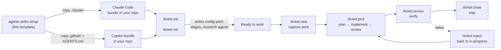
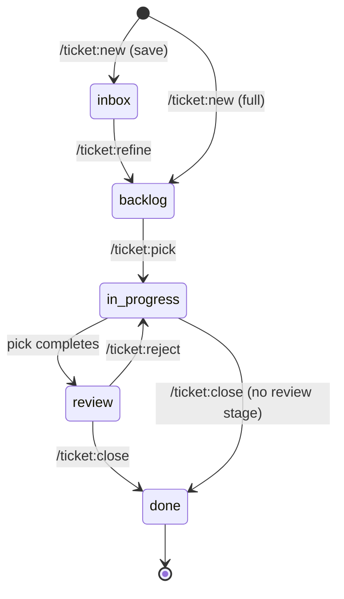
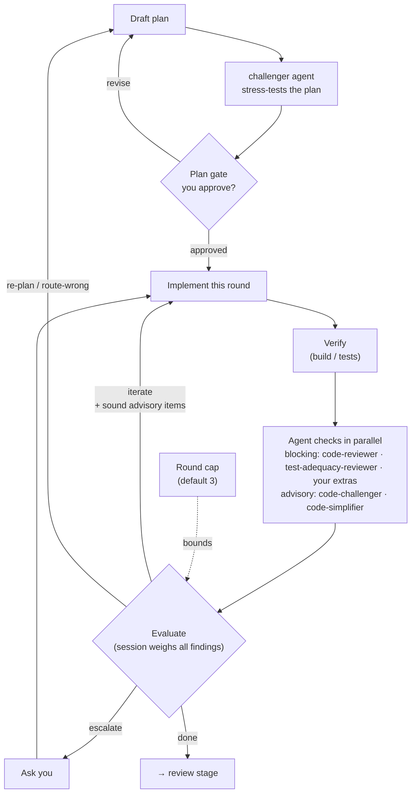

# agents-skills-setup

A **template** for wiring an agentic coding assistant into your project. Use this
repo as a starting point — copy one of its two self-contained bundles into your
own project, customize it, and you get a complete, backend-agnostic **ticket
workflow** plus a handful of auto-triggered **authoring and review agents**.

Everything here is prompt-and-config only: no runtime, no dependencies, no build
step. The commands, skills, and agents are Markdown instructions the assistant
loads on demand and executes with its own tools.

> **This is a template, not a library.** Don't depend on it — fork it, copy it,
> and edit the copied bundle to fit your project. The setup is meant to be
> shaped: rename stages, adjust ticket types, and — most importantly — set up the
> **research agents** your project's ticket creation needs. Init guides you
> through that (see below); thinking about your sources beforehand makes its
> questions easy to answer.

## Two setups: `claude` and `copilot`

The repo ships **two parallel, functionally-equal bundles**. Pick the one that
matches your assistant — each is fully self-contained, and you only copy one.

| Assistant | Bundle | Commands look like | Config path |
| --- | --- | --- | --- |
| **Claude Code** | [`.claude/`](.claude/) | `/ticket:new` | `.claude/config.yaml` |
| **GitHub Copilot** | [`.github/`](.github/) + [`AGENTS.md`](AGENTS.md) | `/ticket-new` | `.github/config.yaml` |

The two bundles are kept in lockstep by `scripts/check-bundle-sync.sh` (run in CI)
— any logic change lands in both. See each bundle's own README for the full
directory breakdown:

- **Claude Code →** [.claude/README.md](.claude/README.md)
- **GitHub Copilot →** [.github/README.md](.github/README.md)

---

## Quickest start — let the assistant set it up

You don't have to copy files by hand. Open your project in your coding assistant
(Claude Code or Copilot) and paste this prompt — it copies the right bundle for
your provider and leaves you ready to run init:

```text
Look at this repo https://github.com/elmoritz/agents-skills-setup and set up this
project with its agents-and-skills bundle.

- Detect which assistant I'm using and copy the matching self-contained bundle
  into my project root — the whole `.claude/` directory for Claude Code, or the
  whole `.github/` directory plus `AGENTS.md` for GitHub Copilot. Copy the folder
  whole; don't cherry-pick files.
- Don't run init yet. Just leave me ready to run the `/ticket:init` command
  (Claude Code) or the `/ticket-init` command / `ticket:init` skill (Copilot),
  and tell me which one applies to me.
```

Then run the init command it points you to (`/ticket:init` or `/ticket-init`) and
answer the prompts — that's where you tailor stages, backend, and your **research
agents** (Step 0 below). Prefer to do the copy yourself? The manual steps are in
[Getting started](#getting-started).

### How the pieces fit together



> **Diagrams not rendering?** The diagrams in this README are [Mermaid](https://mermaid.js.org/).
> GitHub, GitLab, and most modern Markdown viewers render them inline. If you see
> raw ```mermaid``` code instead, view the file on GitHub or in an editor with a
> Mermaid preview extension — the surrounding prose stands on its own either way.

---

## Step 0 — before you init: think about your sources of information

When you create a ticket, the assistant researches the work — reading existing
code, docs, APIs, design specs, prior tickets, external references. If it reads
all of that **inline**, the raw source material floods the main context and
crowds out the actual ticket. The fix is to push each **source of information
into its own research agent**:

> **Any source that holds information should be a research agent, not inline
> reading.** An agent reads the source in its *own* isolated context and returns
> only the distilled finding — so the main conversation stays clean and the
> ticket body carries conclusions, not dumps.

**Init sets these up for you.** The init command's research-agent step walks you
through a shipped catalog — pick what fits, answer a couple of fill-in questions
per pick (your stack, your doc paths…), and it writes the agent files and
registers them in the config. Two catalog entries are recommended for every
project, because every project has a tech stack and a language:

- **`perf-expert`** — a performance expert for *your* tech stack, consulted
  whenever the work could affect latency, memory, or throughput.
- **`language-expert`** — an expert in *your* language(s) and their idioms,
  consulted on language-level design questions.

The rest of the catalog covers the usual sources — internal docs/wiki
(`docs-researcher`), API/SDK references (`api-docs-researcher`), design specs
(`design-spec-researcher`), in-repo prior art (`precedent-researcher`), and
external web research with license rules baked in (`web-researcher`) — and init
also loops to generate **custom agents** for any source it doesn't cover
("search our Notion", "check crates.io"…).

So before you run init, just think through: *which sources would I otherwise
paste into the conversation?* Agents you hand-author under `.claude/agents/` /
`.github/agents/` before init are detected and offered for registration too.
Ticket creation then dispatches the registered agents during its analysis and
research steps instead of reading those sources inline.

---

## Getting started

### Claude Code

1. **Copy the whole [`.claude/`](.claude/) directory** into the root of your
   project. Don't cherry-pick — the commands call into the skills, and the skills
   read `.claude/config.yaml`.
2. Run **`/ticket:init`** and answer the prompts. It generates
   `.claude/config.yaml` tailored to your backend (filesystem or GitHub) and
   lifecycle — and guides you through setting up your **research agents** (Step 0).
3. Capture your first piece of work with **`/ticket:new`**.
4. Implement it with **`/ticket:pick`**, then close it out with **`/ticket:close`**.

Full details: [.claude/README.md](.claude/README.md).

### GitHub Copilot

1. **Copy the whole [`.github/`](.github/) directory and [`AGENTS.md`](AGENTS.md)**
   into your project root. The bundle ships the workflow as **Agent Skills**, so it
   works across VS Code agent mode, the Copilot CLI, and the cloud agent.
2. Run **`/ticket-init`** and answer the numbered prompts. It generates
   `.github/config.yaml` tailored to your backend (filesystem or GitHub) — and
   guides you through setting up your **research agents** (Step 0).
3. Capture your first piece of work with **`/ticket-new`**.
4. Implement it with **`/ticket-pick`**, then close it out with **`/ticket-close`**.

Full details: [.github/README.md](.github/README.md).

---

## The ticket workflow

A small, opinionated issue tracker that lives in your repo and runs through a
handful of slash commands. The same commands work whether tickets are **Markdown
files committed to the repo** (filesystem backend) or **GitHub issues** (github
backend) — the choice lives in your bundle's `config.yaml`, and every command
delegates the actual reads, writes, and stage transitions to the **`ticket-engine`**
skill.

| Command (Claude / Copilot) | What it does |
| --- | --- |
| `/ticket:init` · `/ticket-init` | Bootstrap a project: write `config.yaml`, create the stage folders or labels, lay down a starter ticket template. One-time. |
| `/ticket:new` · `/ticket-new` | Create one ticket — or a small slate of dependent ones — through a gated flow that reconciles your intent with the assistant's understanding before anything is committed. |
| `/ticket:refine` · `/ticket-refine` | Resume a captured inbox entry and promote it to the backlog (or close it as a fold/wontfix). |
| `/ticket:pick` · `/ticket-pick` | Pull the next ticket off the backlog and implement it through to review — the plan is stress-tested by the `challenger` agent, then implementation runs as a bounded **implement → agent-checks → evaluate** loop where every round also runs `code-challenger` and `code-simplifier` as advisory passes (configurable checker set and round cap). |
| `/ticket:review` · `/ticket-review` | Print a read-only verification guide for a ticket in review. |
| `/ticket:reject` · `/ticket-reject` | Send a ticket that failed verification back to in-progress, with the reason recorded on the ticket. |
| `/ticket:close` · `/ticket-close` | Close a ticket as shipped, trusting you've verified the work. |

Tickets move through configurable **stages** (inbox → backlog → in-progress →
review → done), each carrying a **role** the engine resolves against. Effort caps
keep the backlog honest: every ticket landing in the pickable stage must fit the
project's allowed size, and ticket creation silently splits work that's too big.



Stages are configurable — a project can drop the `inbox` or `review` stage, and
the commands adapt (e.g. with no review stage, `/ticket:pick` runs straight to
closure-ready and `/ticket:close` ships from in-progress).

**Ticket data lives native, not in frontmatter.** On the GitHub backend, issues
carry **no YAML frontmatter** — dependencies are native issue dependencies
(blocked-by), the claim clock is the assignment event, priority/effort/risk live
as Project board fields (labels as fallback) or labels, and `type` maps to native
org issue types where available. On the filesystem backend, ticket files keep
self-describing frontmatter while the graph data — `depends_on`, `related`,
`milestone` — lives in a machine-owned **ledger** (`.ledger.yaml`) beside the
stage folders, updated in the same commit as every event.

On the GitHub backend you can optionally **link tickets to a GitHub Project (v2)
board**: init lets you pick a project, and from then on every ticket is added to it
on creation with its `Status` field synced to the workflow stage — and Priority /
Effort / Risk live as board fields init creates if missing. The issue stays
the source of truth for stage — a failed board update never blocks a transition.

### Aligned by design

Ticket creation treats shared understanding as a first-class goal. After analyzing
the relevant code (and dispatching your research agents), it runs an
**alignment-grilling pass** — walking the decision tree branch by branch, answering
what it can from the codebase and asking you only the questions that genuinely
change scope, type, acceptance criteria, or size. Every answer (and every silent
default) is recorded in a `## Decisions & assumptions` section on the ticket, so
whoever picks it up later sees the same reconciled view you signed off on.

## The skills

Skills trigger automatically when their description matches what you're doing —
you don't invoke them by hand.

- **`ticket-engine`** — the shared execution layer behind every ticket command.
  Loads and validates `config.yaml`, assigns IDs, runs backend-specific transitions
  (filesystem commits or GitHub label flips), formats commit/comment messages, and
  reports precise half-state on partial failure.
- **`milestone-sync`** — detects and fixes drift between a milestone's declared
  state and the tickets that reference it. Read-only until you approve a fix; each
  fix lands as its own atomic event. Runs as a preflight in pick, a postflight in
  close, or standalone.
- **`grill-me`** — interviews you relentlessly about a plan or design, resolving
  each branch of the decision tree one dependency at a time, with a recommended
  answer for every question. Use it to stress-test a design before you build.

## The review agents

Alongside the **research agents you add** (Step 0), each bundle ships five
read-only **review agents**, wired into the pick command. Each judges only what's
on disk and changes nothing; the main session owns any resulting edits.

- **`challenger`** — devil's advocate against a freshly drafted plan: concrete
  failure scenarios and cheaper alternatives, grounded in the code, never vague
  doubt. Runs in step 3, so you judge plan and challenge together at the Plan gate.
- **`code-reviewer`** — reviews an implementation diff against the approved plan,
  architecture invariants, and conventions; verdict + file:line findings.
- **`test-adequacy-reviewer`** — checks whether the new tests would actually go red
  if the change were reverted, catching assertion-free and mock-only tests.
- **`code-challenger`** — the loop-time sibling of `challenger`: every round it
  attacks the *route the code actually took* — hidden coupling, a cheaper
  implementation, an irreversible step, or a plan that turned out wrong.
- **`code-simplifier`** — proposes behavior-preserving simplifications of the diff
  as ready-to-apply patches.

`code-reviewer` and `test-adequacy-reviewer` are the default **blocking** checkers
in pick's **implementation loop**: each round implements, verifies, dispatches the
configured `review.agents` in parallel, and ends in an explicit evaluation that
decides *done / iterate / re-plan / escalate* — bounded by a configurable round
cap (default 3). Projects can register extra checkers (a11y, security…) in
`config.yaml` without touching the command. `code-challenger` and `code-simplifier`
run **every round too, as advisory passes** — the session weighs their findings in
the evaluation and folds the sound ones into the next round's work-list (no user
gate); a `code-challenger` "route-wrong" verdict can send the loop back to re-plan.

The loop inside `/ticket:pick` looks like this:



Each agent also works standalone on any plan or diff.
