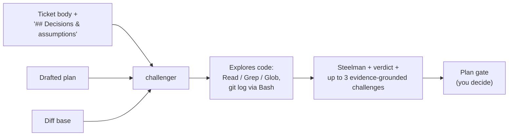

# `challenger`

Devil's advocate against a freshly drafted implementation **plan** — the
paper stage, before you approve it. Attacks the approach with codebase
evidence: concrete failure scenarios and cheaper alternatives, never vague
doubt.

| | |
| --- | --- |
| **Triggered by** | [`/ticket:pick`](../workflow/pick.md) step 3, right after the plan is drafted, before the Plan gate — dispatched alongside the plan so you judge both together |
| **Also usable** | Standalone, against any design or plan |
| **Tools** | Read, Grep, Glob, Bash |

## Flow

## Verdicts

| Verdict | Meaning |
| --- | --- |
| `PLAN STANDS` | No material weakness found |
| `WEAKNESSES` | Named, evidence-grounded concerns — plan may still be approved as-is |
| `RIVAL ROUTE` | A cheaper or more direct route exists |
| `ASSUMPTION-BROKEN` | A load-bearing assumption in the plan doesn't hold |

Challenges are capped at 3, each grounded in one of: hidden coupling, a
concrete failure scenario, a cheaper route, an irreversible step, a
load-bearing assumption, or an effort mismatch.

**Gates directly?** No — feeds your Approve / Edit / Abandon decision at the
Plan gate; it never edits or blocks on its own.

## See also

- [`code-challenger`](code-challenger.md) — the loop-time sibling that attacks the code as built, instead of the paper plan
