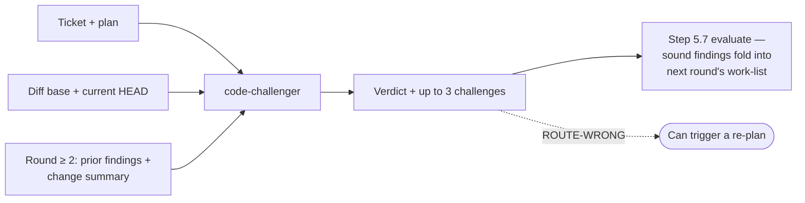

# `code-challenger`

The loop-time sibling of [`challenger`](challenger.md) — attacks the route
the **code as built** actually took, not the paper plan. Runs every round, on
whatever the diff has become by then.

| | |
| --- | --- |
| **Triggered by** | [`/ticket:pick`](../workflow/pick.md) step 5.5, every loop round, alongside `code-reviewer` — advisory, always on, not configurable |
| **Also usable** | Standalone, on any diff |
| **Tools** | Read, Grep, Glob, Bash |

## Flow

## Verdicts

| Verdict | Meaning |
| --- | --- |
| `CODE STANDS` | No material weakness in the route taken |
| `WEAKNESSES` | Named concerns — foldable into the next round's work-list |
| `CHEAPER ROUTE` | A less costly implementation exists |
| `ROUTE-WRONG` | The route taken is fundamentally wrong — can send the loop back to re-plan |
| `ASSUMPTION-BROKEN` | A load-bearing assumption no longer holds |

**Gates directly?** No — advisory. The step 5.7 evaluation weighs its
findings and can fold sound ones into the next round's work-list; only a
`ROUTE-WRONG` verdict carries enough weight to trigger a re-plan on its own.

## See also

- [`challenger`](challenger.md) — the plan-stage counterpart, run once before implementation starts
