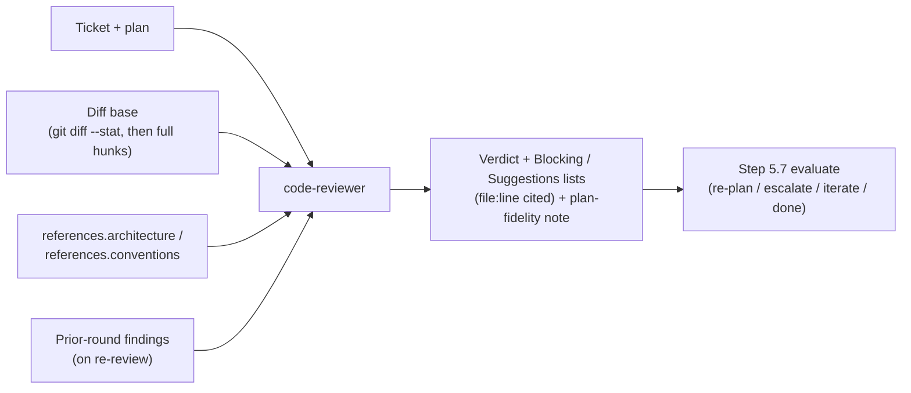

# `code-reviewer`

Read-only review of a ticket's implementation **diff** against the approved
plan, architecture invariants, and project conventions.

| | |
| --- | --- |
| **Triggered by** | [`/ticket:pick`](../workflow/pick.md) step 5.5, every loop round — one of the default **blocking** checkers via `review.agents` (default: `[code-reviewer, test-adequacy-reviewer]`) |
| **Also usable** | Standalone, on any uncommitted or branch diff |
| **Tools** | Read, Grep, Glob, Bash |

## Flow

## Verdicts

| Verdict | Meaning |
| --- | --- |
| `PASS` | Clean — no findings |
| `PASS WITH SUGGESTIONS` | Non-blocking suggestions only |
| `BLOCKED` | At least one blocking finding |

Findings are capped at 10 blocking + 10 suggestions, each cited by file:line.

**Gates directly?** No — a blocking finding feeds the step 5.7 evaluation's
decision (re-plan / escalate / iterate / done); the agent itself never edits
or blocks.

## See also

- [`test-adequacy-reviewer`](test-adequacy-reviewer.md) — the other default blocking checker, focused on test quality rather than implementation quality
