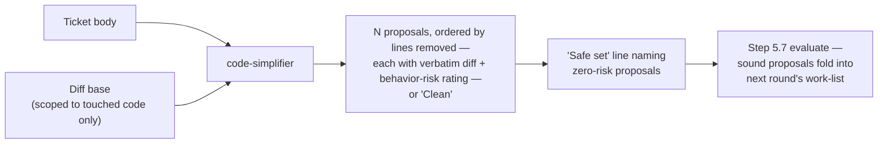

# `code-simplifier`

Proposes behavior-preserving simplifications of the diff — speculative
generality, needless indirection, dead weight, duplication, over-defensive
code — as ready-to-apply patches.

| | |
| --- | --- |
| **Triggered by** | [`/ticket:pick`](../workflow/pick.md) step 5.5, every loop round, alongside `code-reviewer` and `code-challenger` — advisory, always on |
| **Also usable** | Standalone, on any diff |
| **Tools** | Read, Grep, Glob, Bash |

## Flow

## Output shape

- `N proposals | Clean` header.
- Each proposal: a verbatim diff, ordered by lines-removed (biggest win first), tagged with a behavior-risk rating.
- A `Safe set` line calling out the zero-risk subset — the ones the session can fold in without a second look.

**Gates directly?** No — advisory. Sound proposals fold into the next round's
work-list by the session's own evaluation; nothing here applies itself.

## See also

- [`code-reviewer`](code-reviewer.md) — the blocking checker this agent runs alongside every round
