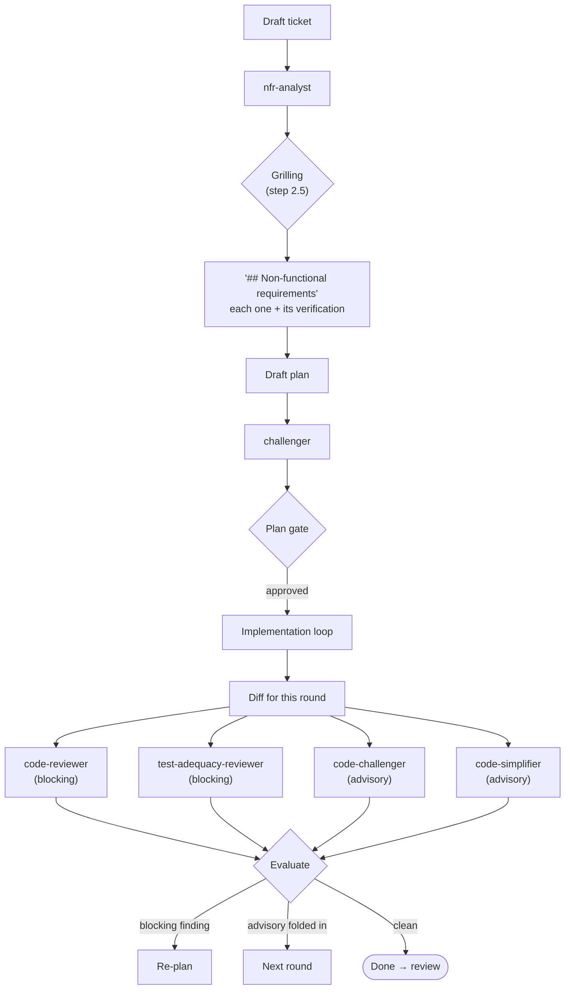

# Shipped agents

Six read-only subagents, all `tools: Read, Grep, Glob, Bash` — none of them
edit anything, and none of them gate you directly. Each returns a verdict
that the calling session weighs; only the main session ever acts on a
finding. Alongside the research agents you register yourself (see [Getting
started § Step 0](../getting-started.md#step-0-research-agents)), these ship
with every bundle: one wires into [`/ticket:new`](../workflow/new.md), the
other five into [`/ticket:pick`](../workflow/pick.md).

| Agent | Stage | Role | Blocking? |
| --- | --- | --- | --- |
| [`nfr-analyst`](nfr-analyst.md) | Creation (once) | Derives the ticket's non-functional requirements before scope is locked | Feeds the step 2.5 grilling |
| [`challenger`](challenger.md) | Plan (once) | Stress-tests the drafted plan before you approve it | Feeds the Plan gate |
| [`code-reviewer`](code-reviewer.md) | Every loop round | Reviews the diff against the plan, architecture, conventions | **Blocking** |
| [`test-adequacy-reviewer`](test-adequacy-reviewer.md) | Every loop round | Checks whether new tests would actually fail on a revert | **Blocking** |
| [`code-challenger`](code-challenger.md) | Every loop round | Attacks the route the code actually took | Advisory |
| [`code-simplifier`](code-simplifier.md) | Every loop round | Proposes behavior-preserving simplifications | Advisory |

`code-reviewer` and `test-adequacy-reviewer` are the **default** blocking
checkers, configured via `review.agents` in `config.yaml` — projects can
register extra checkers (a11y, security…) without touching the command.
`nfr-analyst`, `challenger`, `code-challenger`, and `code-simplifier` are
fixed, not configurable. Every agent also works **standalone** against any
described work, plan, or diff, outside the commands.

**Why no NFR agent in the loop.** The non-functional work is front-loaded on
purpose. At creation the failure mode is *omission* — a requirement nobody
stated, which nobody can check later — and catching that needs a specialist.
By the time the loop runs, the requirement is written on the ticket with its
verification named, so the failure mode is *compliance* against a written
list, which `code-reviewer` and `test-adequacy-reviewer` already handle. A
project whose dimension genuinely can't be judged by a generalist reading a
diff registers its own checker in `review.agents`.

## See also

- [`/ticket:pick`](../workflow/pick.md) — the implementation loop these agents run inside
