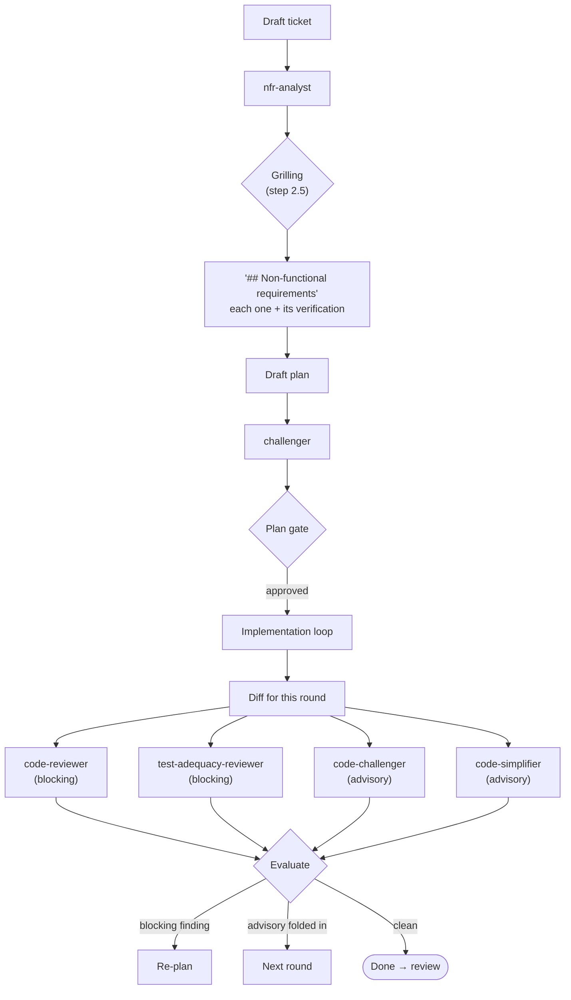

# Shipped agents

Six read-only subagents — `tools: Read, Grep, Glob, Bash` in the Claude Code
bundle, `subagent: true` in the `.agents` bundle — none of them
edit anything, and none of them gate you directly. What ships is each agent's
**default rendering**: `/ticket:init` regenerates its role, project focus and
researched knowledge for your stack, while its **contract** — what it is given,
what it must return, what it may never do — stays exactly as documented on
these pages (see [Generated agents](generated.md)). Each returns a verdict
that the calling session weighs; only the main session ever acts on a
finding. Alongside the research agents init generates for your project (see
[Getting started § Step 0](../getting-started.md#step-0-research-agents)), these
ship with every bundle: one wires into [`/ticket:new`](../workflow/new.md) (and
`/ticket:refine`'s resume path), the other five into
[`/ticket:pick`](../workflow/pick.md).

| Agent | Stage | Role | Blocking? |
| --- | --- | --- | --- |
| [`nfr-analyst`](nfr-analyst.md) | Creation (once) | Derives the ticket's non-functional requirements before scope is locked | Feeds the step 2.5 grilling |
| [`challenger`](challenger.md) | Plan (once) | Stress-tests the drafted plan before you approve it | Feeds the Plan gate |
| [`code-reviewer`](code-reviewer.md) | Every loop round | Reviews the diff against the plan, architecture, conventions | **Blocking** |
| [`test-adequacy-reviewer`](test-adequacy-reviewer.md) | Every loop round | Checks whether new tests would actually fail on a revert | **Blocking** |
| [`code-challenger`](code-challenger.md) | Every loop round | Attacks the route the code actually took | Advisory |
| [`code-simplifier`](code-simplifier.md) | Every loop round | Proposes behavior-preserving simplifications | Advisory |

```mermaid
flowchart TD
    Ticket["Draft ticket"] --> NFR["nfr-analyst"]
    NFR --> Grill{"Grilling<br/>(step 2.5)"}
    Grill --> Section["'## Non-functional requirements'<br/>each one + its verification"]
    Section --> Plan["Draft plan"]

    Plan --> Challenger["challenger"]
    Challenger --> Gate{"Plan gate"}
    Gate -->|approved| Loop["Implementation loop"]

    Loop --> Diff["Diff for this round"]
    Diff --> CR["code-reviewer<br/>(blocking)"]
    Diff --> TAR["test-adequacy-reviewer<br/>(blocking)"]
    Diff --> CC["code-challenger<br/>(advisory)"]
    Diff --> CS["code-simplifier<br/>(advisory)"]

    CR --> Eval{"Evaluate"}
    TAR --> Eval
    CC --> Eval
    CS --> Eval
    Eval -->|blocking finding| Replan["Re-plan"]
    Eval -->|advisory folded in| Iterate["Next round"]
    Eval -->|clean| Done(["Done → review"])
```

`code-reviewer` and `test-adequacy-reviewer` are the **default** blocking
checkers, configured via `review.agents` in `config.yaml` — projects can
register extra checkers (a11y, security…) without touching the command, and init
can generate one from the `checker` kind when a hard requirement (an
`nfr.budgets` entry, a compliance rule) calls for it. `nfr-analyst`,
`challenger`, `code-challenger`, and `code-simplifier` are fixed and always on;
project **advisors** (the `advisor` kind) can join them through
`review.plan_advisors` and `review.advisors` — see
[Advisors and checkers](generated.md#advisors-and-checkers). Every reply is
checked with `te agent reply-check` before it is weighed
([The reply check](generated.md#the-reply-check)). Every agent also works **standalone** against any
described work, plan, or diff, outside the commands.

**Why no NFR agent in the loop.** The non-functional work is front-loaded on
purpose. At creation the failure mode is *omission* — a requirement nobody
stated, which nobody can check later — and catching that needs a specialist.
By the time the loop runs, the requirement is written on the ticket with its
verification named, so the failure mode is *compliance* against a written
list, which `code-reviewer` and `test-adequacy-reviewer` already handle. A
project whose dimension genuinely can't be judged by a generalist reading a
diff registers its own checker in `review.agents`.

## See also

- [`/ticket:pick`](../workflow/pick.md) — the implementation loop these agents run inside
