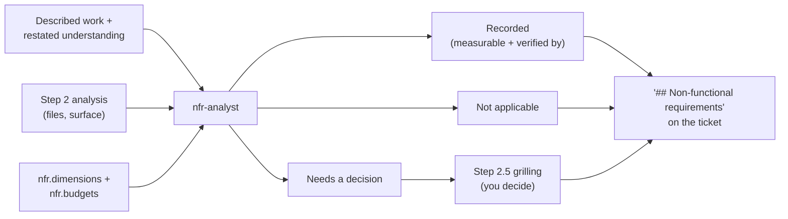

# `nfr-analyst`

Derives a ticket's **non-functional requirements** while it is still being
written — before scope is locked. The failure it exists to prevent is
omission: nobody can check a requirement that was never written down.

| | |
| --- | --- |
| **Triggered by** | [`/ticket:new`](../workflow/new.md) step 2, alongside the research agents, before the step 2.5 grilling — and [`/ticket:refine`](../workflow/refine.md) on its resume path |
| **Also usable** | Standalone, against any described work |
| **Tools** | Read, Grep, Glob, Bash |

It is **fixed**: it runs on every ticket, of every type, and cannot be
configured away. What *is* configurable is the profile it judges against —
the optional [`nfr:` block](../config/reference.md) supplies your project's
dimensions and budgets.

## Flow

## Dimensions

`performance` · `security` · `reliability` · `accessibility` ·
`observability` · `privacy` · `compatibility` · `operability`

Each is considered exactly once per ticket and **accounted for in the
output** — a dimension that doesn't apply is recorded as not applicable with
one clause of reason, never silently dropped. That record is what stops the
next reader re-asking.

## Verdicts

| Verdict | Meaning |
| --- | --- |
| `NO NFR SURFACE` | This work touches no dimension. A normal, successful run |
| `RECORDED` | Requirements found; all answerable without asking you |
| `DECISIONS NEEDED` | At least one requirement needs your call — it becomes a grilling branch at step 2.5 |

## The rule that makes it enforceable

**Every recorded requirement names its verification** — the test that would
fail without it, the command that measures it, or the manual step that
observes it. A requirement whose verification can't be named is restated
until it is checkable, raised as a decision, or dropped. Nothing else
reaches the ticket.

That rule is why no NFR agent runs during implementation. Once a requirement
is on the ticket with a verification attached, the existing loop enforces it:
[`code-reviewer`](code-reviewer.md) checks each acceptance criterion against
the diff, and [`test-adequacy-reviewer`](test-adequacy-reviewer.md) fails the
round if the criterion's test can't actually go red. A specialist adds little
to *checking a written list* — the hard part was writing it.

Two governors keep it from becoming noise: at most **5** recorded
requirements per ticket (a ticket carrying eight will have all eight
ignored), and any figure the agent proposes rather than reads from
`nfr.budgets` is marked `(proposed)` — yours to approve, not presented as
fact.

**Gates directly?** No — it proposes requirements and pre-drafts the open
decisions; `/ticket:new` writes the section and puts every decision to you.

## See also

- [`/ticket:new`](../workflow/new.md) — where it runs, and how its output becomes the ticket's section
- [`perf-expert`](../getting-started.md#step-0-research-agents) — when registered, the performance dimension is delegated to it
