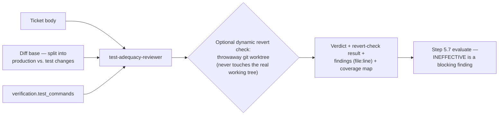

# `test-adequacy-reviewer`

Judges whether the tests accompanying the diff would actually **fail** if the
behavioral change were reverted or broken. Catches assertion-free tests,
tests that only exercise mocks, and untested branches — a green test run says
nothing about whether the tests can go red.

| | |
| --- | --- |
| **Triggered by** | [`/ticket:pick`](../workflow/pick.md) step 5.5, every loop round — the other default **blocking** checker via `review.agents` |
| **Also usable** | Standalone, on any diff |
| **Tools** | Read, Grep, Glob, Bash |

## Flow

## Verdicts

| Verdict | Meaning |
| --- | --- |
| `ADEQUATE` | Tests would catch a revert or a broken change |
| `GAPS` | Some behavior is untested, but what exists is sound |
| `INEFFECTIVE` | Tests exist but wouldn't actually fail on a revert — **blocking** |

Findings are tagged `INEFFECTIVE` / `WEAK` / `UNCOVERED`, cited by file:line.

**Gates directly?** No — an `INEFFECTIVE` verdict feeds the step 5.7
evaluation as a blocking finding, same precedence as a `code-reviewer` block.

## See also

- [`code-reviewer`](code-reviewer.md) — the other default blocking checker, focused on implementation quality
