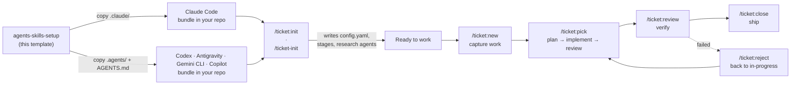

# agents-skills-setup

A **template** for wiring an agentic coding assistant into your project. Copy one
of its two self-contained bundles into your own project, customize it, and you
get a complete, backend-agnostic **ticket workflow** plus a handful of
auto-triggered **authoring and review agents**.

Everything in the bundles is prompt-and-config only: no runtime, no
dependencies, no build step. The commands, skills, and agents are Markdown
instructions your assistant loads on demand and executes with its own tools.

This site is the detailed reference — every command, skill, and review agent,
with a diagram of how it actually moves through its steps and gates. For the
five-minute version (copy the bundle, run init, ship your first ticket), see
[Getting started](getting-started.md).

## Two bundles, five assistants

| Assistant | Bundle | Commands look like | Config path |
| --- | --- | --- | --- |
| **Claude Code** | `.claude/` | `/ticket:new` | `.claude/config.yaml` |
| **OpenAI Codex** | `.agents/` + `AGENTS.md` | `$ticket-new` | `.agents/config.yaml` |
| **Google Antigravity** | `.agents/` + `AGENTS.md` | `/ticket-new` | `.agents/config.yaml` |
| **Gemini CLI** | `.agents/` + `AGENTS.md` | `/ticket-new` | `.agents/config.yaml` |
| **GitHub Copilot** | `.agents/` + `AGENTS.md` | `/ticket-new` | `.agents/config.yaml` |

The two bundles are **functionally identical, byte-for-byte-equivalence-checked
mirrors** of each other (`.agents/skills/` is where Codex, Antigravity, Gemini
CLI, and Copilot all discover [Agent Skills](https://agentskills.io); Claude Code
reads only `.claude/`). This site documents the workflow **once** — wherever a
command name differs by assistant, both forms are shown side by side. See
[Platform support](platform-support.md) for the full evidence behind the split.

## What's documented here

- :material-sitemap:{ .lg .middle } **[Workflow](workflow/overview.md)**

    ---

    The seven `/ticket:*` commands that take work from idea to shipped — what
    each one gates on, what it reads and writes, and where it can exit.

- :material-puzzle:{ .lg .middle } **[Skills](skills/index.md)**

    ---

    The shared machinery every command runs on: the execution engine, the
    milestone-drift detector, and the standalone alignment interviewer.

- :material-account-check:{ .lg .middle } **[Shipped agents](agents/index.md)**

    ---

    Six read-only subagents: one derives a ticket's non-functional
    requirements at creation, five stress-test plans and diffs inside
    `/ticket:pick`'s implementation loop — and all work standalone too.

- :material-cog:{ .lg .middle } **[Configuration](config/reference.md)**

    ---

    The full shape of `config.yaml`, and a tour of the 18 example projects
    that exercise every backend × milestone × inbox × project-board
    combination.

## Design principle: agents are research, not inline reading

> Any source that holds information should be a research agent, not inline
> reading. An agent reads the source in its *own* isolated context and returns
> only the distilled finding — so the main conversation stays clean and the
> ticket body carries conclusions, not dumps.

`/ticket:init` walks you through registering **research agents** for your
project's own sources (docs, API references, prior art, the web) — see
[Getting started](getting-started.md#step-0-research-agents) — which then get
dispatched automatically during `/ticket:new`'s analysis and research steps.
