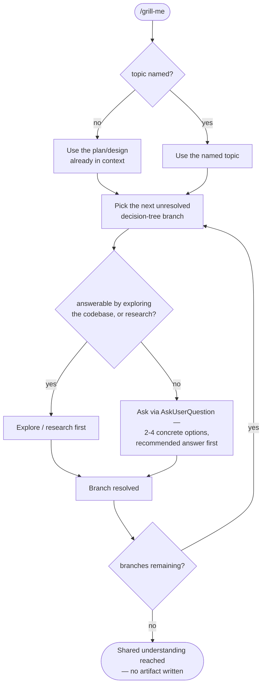

# `grill-me`

Interviews you relentlessly about any plan or design until every branch of
the decision tree resolves to either a decision or a stated assumption.
Standalone — not wired into any ticket command, though `/ticket:new`'s
[alignment-grilling pass](../workflow/overview.md#aligned-by-design) runs the
same underlying pattern.

**Invoked by:** you directly — `/grill-me`, or mentioning "grill me" on a plan
already in context.

## Flow

Every question is itself a gate — there's no separate approval step at the
end; the interview *is* the deliverable.

## See also

- [Aligned by design](../workflow/overview.md#aligned-by-design) — the same interview pattern, embedded inside `/ticket:new`
