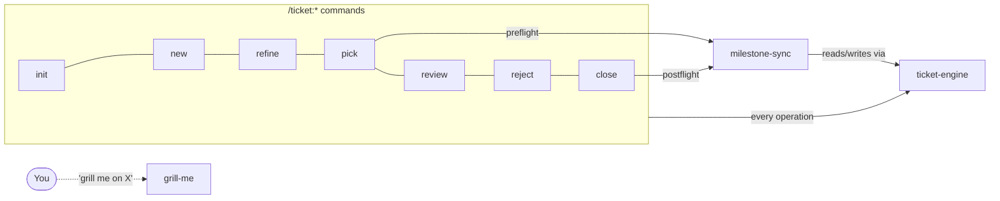

# Skills

Skills are prompt-fragment instructions your assistant loads on demand — there
is no runtime binary. Two of the three trigger automatically as part of the
ticket commands; `grill-me` is meant to be invoked directly.

| Skill | Purpose | Invoked by |
| --- | --- | --- |
| [`ticket-engine`](ticket-engine.md) | Shared execution layer: config, roles, IDs, backend transitions | Every `/ticket:*` command, `milestone-sync` |
| [`milestone-sync`](milestone-sync.md) | Detects and fixes drift between milestone state and its tickets | `/ticket:pick` (preflight), `/ticket:close` (postflight), standalone |
| [`grill-me`](grill-me.md) | Interviews you until a plan/design is fully reconciled | User-invoked, or standalone |

`ticket-engine` never gates the user itself — every `AskUserQuestion` prompt
lives in the calling command. It performs operations the caller has already
decided on and returns a structured result the caller reports back to you.
