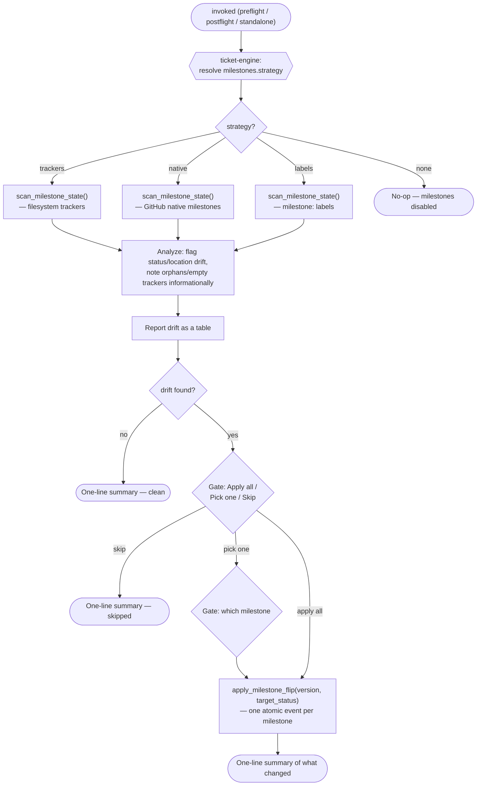

# `milestone-sync`

Detects and fixes drift between a milestone's declared state and the tickets
that reference it — via a ledger entry on the filesystem backend, or a native
milestone / `milestone:` label on GitHub. Read-only until you approve a fix;
each fix lands as its own atomic event.

## When it runs

- **Preflight** in [`/ticket:pick`](../workflow/pick.md), before candidate ranking (`Skip` proceeds regardless of drift found).
- **Postflight** in [`/ticket:close`](../workflow/close.md), scoped to the closed ticket's milestone version.
- **Standalone**, as a health check, optionally scoped to one version (`v0.5.5`) — same full scan either way; reporting drift on neighboring versions costs nothing.

## Flow

The user-visible workflow (scan → report → gate → apply) is identical across
all four strategies — only the storage layer underneath differs, resolved by
[`ticket-engine`](ticket-engine.md).

## See also

- [Configuration reference § milestones](../config/reference.md#milestones) — the four strategies and their config shape
