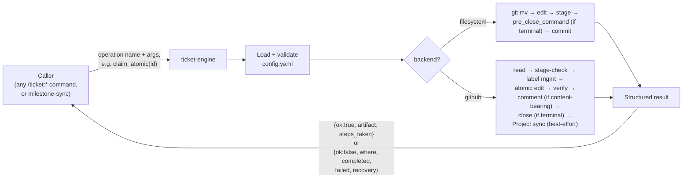

# `ticket-engine`

Project-agnostic execution layer underlying every `/ticket:*` command: config
load/validate, role resolution, ID assignment, per-backend transitions,
message formatting, half-state reporting. Not user-facing — it never gates
the user itself; the caller owns every gate.

## Calling contract

- **Config reload per invocation** — `config.yaml` is re-read every call; the file is tiny, so staleness is never a concern.
- **No user gates inside the engine.** It performs operations the caller has already decided on.
- **`artifact_type` parameter** (default `ticket`) is the seam for a future ADR artifact type — every Part 1 primitive below is artifact-agnostic; ticket-specific behavior (field schema, effort caps, claim staleness) is layered on top.

## What it resolves

- **Roles** (`lifecycle.stages[].roles`) → concrete stage, so commands never hard-code stage names.
- **IDs** — prefix + padding + monotonic counter from `config.yaml`.
- **Field storage** — filesystem: YAML frontmatter + a machine-owned `.ledger.yaml` for `depends_on` / `related` / `milestone`. GitHub: everything native or dual-homed (labels, native issue types, Project v2 fields with label fallback, native issue dependencies, assignment-event-derived claim clock) — issue bodies never carry frontmatter.
- **The ledger** — `.ledger.yaml`, machine-owned, written in the same commit as every event it records.
- **Git branch workflow** (`git.branch_workflow`, default `enabled`) — after claiming, `/ticket:pick` isolates its implementation commits on a per-ticket branch; `/ticket:close` merges it into base (per `merge_strategy`, or via a GitHub PR when `pr_integration: github`) before closing. Ticket-state commits (claim/review/close) always land on base regardless — the branch isolates code, not ticket state.

## Operation catalog

| Operation | Used by |
| --- | --- |
| `load_and_validate` | every command, first step |
| `resolve_role` | every command that branches on stage presence |
| `assign_next_id` | `/ticket:new` |
| `read_artifact` | `/ticket:pick`, `/ticket:review`, `/ticket:refine` |
| `list_artifacts` | `/ticket:pick`, `/ticket:refine`, `/ticket:reject`, `/ticket:close` |
| `create_artifact` | `/ticket:new`, `/ticket:refine` (approve path) |
| `transition_artifact` | `/ticket:pick` (to review / abandon), `/ticket:reject` |
| `claim_atomic` | `/ticket:pick` |
| `update_frontmatter` | `/ticket:pick` (evidence, stale body rewrite) |
| `close_artifact` | `/ticket:close`, `/ticket:refine` (wontfix path) |
| `fold_artifact` | `/ticket:refine` (fold path) |
| `save_as_inbox` | `/ticket:new` (any gate diversion) |
| `enforce_effort_cap` | `/ticket:new` |
| `validate_type_body` | `/ticket:new` |
| `scan_milestone_state` / `apply_milestone_flip` | `milestone-sync` |
| `emit_event` | commit/comment message formatting, every mutating operation |

## See also

- [Configuration reference](../config/reference.md) — the config shape this skill loads and validates
- [Workflow overview](../workflow/overview.md) — how every command routes through this skill
