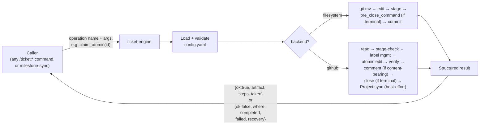

# `ticket-engine`

Project-agnostic execution layer underlying every `/ticket:*` command: config
load/validate, role resolution, ID assignment, per-backend transitions,
message formatting, half-state reporting. Not user-facing — it never gates
the user itself; the caller owns every gate.

## Calling contract

```mermaid
flowchart LR
    Caller["Caller<br/>(any /ticket:* command,<br/>or milestone-sync)"] -->|"operation name + args,<br/>e.g. claim_atomic(id)"| Engine["ticket-engine"]
    Engine --> Config["Load + validate<br/>config.yaml"]
    Config --> Backend{"backend?"}
    Backend -->|filesystem| FS["git mv → edit → stage →<br/>pre_close_command (if terminal) → commit"]
    Backend -->|github| GH["read → stage-check → label mgmt →<br/>atomic edit → verify →<br/>comment (if content-bearing) →<br/>close (if terminal) →<br/>Project sync (best-effort)"]
    FS --> Result
    GH --> Result
    Result["Structured result"] -->|"{ok:true, artifact, steps_taken}<br/>or<br/>{ok:false, where, completed,<br/>failed, recovery}"| Caller
```

- **Config reload per invocation** — `config.yaml` is re-read every call; the file is tiny, so staleness is never a concern.
- **No user gates inside the engine.** It performs operations the caller has already decided on.
- **`artifact_type` parameter** (default `ticket`) is the seam for a future ADR artifact type — every Part 1 primitive below is artifact-agnostic; ticket-specific behavior (field schema, effort caps, claim staleness) is layered on top.

## What it resolves

- **Roles** (`lifecycle.stages[].roles`) → concrete stage, so commands never hard-code stage names.
- **IDs** — prefix + padding + monotonic counter from `config.yaml`.
- **Field storage** — filesystem: YAML frontmatter + a machine-owned `.ledger.yaml` for `depends_on` / `related` / `milestone`. GitHub: everything native or dual-homed (labels, native issue types, Project v2 fields with label fallback, native issue dependencies, assignment-event-derived claim clock) — issue bodies never carry frontmatter.
- **The ledger** — `.ledger.yaml`, machine-owned, written in the same commit as every event it records.
- **Git branch workflow** (`git.branch_workflow`, default `enabled`) — after claiming, `/ticket:pick` isolates its implementation commits on a per-ticket branch; `/ticket:close` merges it into base (per `merge_strategy`, or via a GitHub PR when `pr_integration: github`) before closing. Ticket-state commits (claim/review/close) always land on base regardless — the branch isolates code, not ticket state.

## Operation catalog

| Operation | Used by |
| --- | --- |
| `load_and_validate` | every command, first step |
| `resolve_role` | every command that branches on stage presence |
| `assign_next_id` | `/ticket:new` |
| `read_artifact` | `/ticket:pick`, `/ticket:review`, `/ticket:refine` |
| `list_artifacts` | `/ticket:pick`, `/ticket:refine`, `/ticket:reject`, `/ticket:close` |
| `create_artifact` | `/ticket:new`, `/ticket:refine` (approve path) |
| `transition_artifact` | `/ticket:pick` (to review / abandon), `/ticket:reject` |
| `claim_atomic` | `/ticket:pick` |
| `update_frontmatter` | `/ticket:pick` (evidence, stale body rewrite) |
| `close_artifact` | `/ticket:close`, `/ticket:refine` (wontfix path) |
| `fold_artifact` | `/ticket:refine` (fold path) |
| `save_as_inbox` | `/ticket:new` (any gate diversion) |
| `enforce_effort_cap` | `/ticket:new` |
| `validate_type_body` | `/ticket:new` |
| `scan_milestone_state` / `apply_milestone_flip` | `milestone-sync` |
| `emit_event` | commit/comment message formatting, every mutating operation |

## The `te` CLI

The deterministic half of the engine is `te`, a bash 3.2 + POSIX-awk CLI that
ships in the bundle (`scripts/te`). Output is flat `key=value`; exit codes are
`0` ok · `1` validation/parse/not-found failure · `2` internal error. Every
subcommand is **read-only** except `routers write`.

| Subcommand | What it does | Used by |
| --- | --- | --- |
| `config validate [path]` | Parse and validate `config.yaml`; print the resolved config and roles→stage map | every command (`load_and_validate`) |
| `ledger validate [config]` | Validate the filesystem ledger | every command on the filesystem backend |
| `manifest validate [path]` | Validate `setup/manifest.yaml` — probe states, sourced facts, provenance, commands, research, assistants, agent records | `/ticket:init` |
| `agent check <file> [--kind K]` | Generated-agent anatomy: contract regions byte-identical to the kind, declared generated regions, user region; prints region hashes | `/ticket:init` |
| `agent contract <kind>` | Print a kind's contract regions verbatim, to paste into an agent | `/ticket:init` |
| `agent drift [manifest]` | Per generated agent: `ok` / `missing` / `invalid`; per region: `untouched` / `edited` / `added` / `removed` | `/ticket:init` update mode |
| `agent reply-check (--kind K \| --agent NAME) <file>` | Check a subagent reply: one verdict line with an allowed verdict, plus the promised headings | `/ticket:new`, `/ticket:refine`, `/ticket:pick` |
| `routers (check\|write) [--root DIR] [--assistants …] [name…]` | Subagent routers for Codex, Gemini CLI and Copilot into `.agents/agents/<name>.md`, plus `.gemini/settings.json` when absent | `/ticket:init`, `scripts/gen-adapters.sh` |
| `slug`, `id next`, `deps check`, `effort-cap`, `validate-body`, `msg` | ID, filename, dependency, size and message helpers | `/ticket:new`, transitions |
| `read`, `list`, `milestone scan`, `projects resolve` | The uniform read path on both backends | `/ticket:pick`, `/ticket:review`, `milestone-sync`, … |

`te --help` prints the full usage.

## See also

- [Configuration reference](../config/reference.md) — the config shape this skill loads and validates
- [Workflow overview](../workflow/overview.md) — how every command routes through this skill
