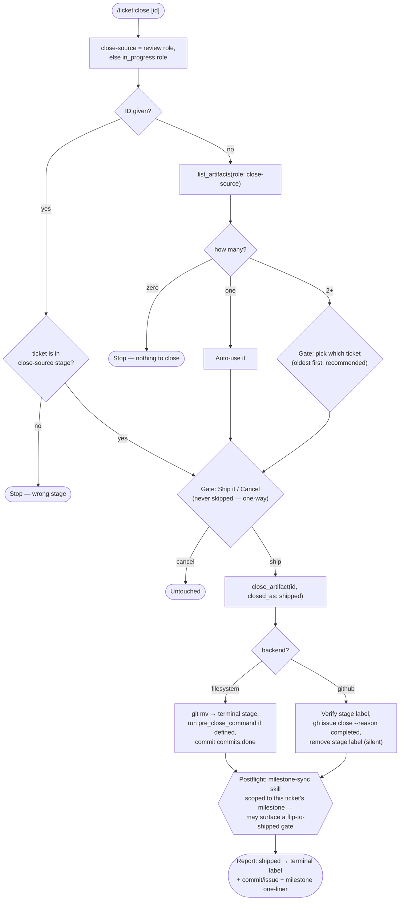

# `/ticket:close`

*Codex: `$ticket-close` · Antigravity / Gemini CLI / Copilot: `/ticket-close`*

Ships a verified ticket. Closes from the `review` stage if one is configured,
otherwise from `in_progress`. Trusts your own verification — this command
never runs tests itself.

**Precondition:** a close-source stage must resolve: `review` if configured,
else `in_progress`.

## Flow

## Reads / writes

- **Writes:** `close_artifact` (filesystem: `git mv` + commit; GitHub: issue close + label removal); the [`milestone-sync` skill](../skills/milestone-sync.md) postflight may write its own atomic fix as a separate event.

## Exit states

| Outcome | Result |
| --- | --- |
| Shipped | Ticket in the terminal stage |
| Cancelled | Nothing changed |
| Half-state | Surfaced and stopped — e.g. `pre_close_command` fails after the move already happened |

## See also

- [`/ticket:review`](review.md) — the verification guide you'd run first
- [`milestone-sync` skill](../skills/milestone-sync.md) — the postflight this command triggers
