# `/ticket:init`

*Codex: `$ticket-init` · Antigravity / Gemini CLI / Copilot: `/ticket-init`*

One-time bootstrap. Interactively generates `config.yaml`, applies its side
effects (stage folders + ledger, or GitHub labels/Project fields), sets up
research agents, and writes a starter ticket template.

**Precondition:** `config.yaml` must **not** already exist — init refuses to
run over an existing config, with no overwrite option.

## Flow

```mermaid
flowchart TD
    Start(["/ticket:init"]) --> Guard{"config.yaml<br/>already exists?"}
    Guard -->|yes| Refuse["Stop — refuse to overwrite"]
    Guard -->|no| G1{"Gate: backend<br/>filesystem or GitHub?"}

    G1 -->|filesystem| G2fs{"Gate: ticket root<br/>docs/project/, tickets/, .tickets/"}
    G1 -->|github| Detect["Detect repo via gh repo view"]
    Detect --> G2gh{"Gate: confirm repo"}
    G2gh --> DetectTypes["Detect org issue types"]
    DetectTypes --> G2map{"Gate: map type_map<br/>proposed / edit / labels-only"}

    G2fs --> G3
    G2map --> G3

    G3{"Gate: ticket ID prefix"} --> G4{"Gate: include inbox stage?"}
    G4 --> G5{"Gate: milestones strategy<br/>Auto / Labels / None"}

    G5 --> G6{"backend == github?"}
    G6 -->|no| G7
    G6 -->|yes| G6a{"Gate: link a GitHub<br/>Project v2 board?"}
    G6a -->|no| G7
    G6a -->|yes| ProjSetup["Resolve owner, list projects"]
    ProjSetup --> G6b{"Gate: pick a project,<br/>or Create a new Project<br/>(default if none exist)"}
    G6b -->|existing| ProjFields["Read Status field,<br/>build status_map,<br/>plan Priority/Effort/Risk fields"]
    G6b -->|create new| ProjPending["Record title, mark project pending —<br/>nothing created yet"]
    ProjPending --> ProjPlan["Plan Status from stage labels +<br/>Priority/Effort/Risk fields<br/>(all missing by construction)"]
    ProjFields --> G7
    ProjPlan --> G7

    G7["Detect existing hand-authored<br/>research agents"] --> G7a{"found any?"}
    G7a -->|yes| G7g{"Gate: register which ones"}
    G7a -->|no| G7cat
    G7g --> G7cat{"Gate: pick from catalog<br/>(multiSelect)<br/>perf-expert · language-expert ·<br/>docs-researcher · api-docs-researcher ·<br/>design-spec-researcher · precedent-researcher ·<br/>web-researcher"}
    G7cat --> G7fill["Fill template blanks<br/>(stack, doc paths…)"]
    G7fill --> G7custom{"Gate: add a custom<br/>source agent? (loop)"}
    G7custom -->|add one| G7fill
    G7custom -->|done| G8

    G8{"Gate: which assistants<br/>read this repo?"} --> G8a{"Gate: branch per ticket?<br/>(pick + close manage a<br/>git branch, default yes)"}
    G8a -->|no| G9["Assemble full config.yaml<br/>from all gate answers"]
    G8a -->|yes| G8b{"Gate: merge strategy<br/>merge / squash / ff_only"}
    G8b --> G8c{"backend == github?"}
    G8c -->|no| G9
    G8c -->|yes| G8d{"Gate: local merge or<br/>GitHub PR?"}
    G8d --> G9
    G9 --> G9g{"Gate: Apply / Edit / Cancel"}
    G9g -->|edit| G9
    G9g -->|cancel| Cancelled["Nothing written"]
    G9g -->|apply| CreateProject{"project was<br/>pending?"}
    CreateProject -->|yes| DoCreateProject["gh project create —<br/>resolve real project number"]
    DoCreateProject --> Apply["Write config.yaml, verify/chmod te,<br/>load_and_validate()"]
    CreateProject -->|no| Apply

    Apply --> Valid{"config valid?"}
    Valid -->|no| AbortInvalid["Stop — uncommitted file<br/>left for inspection"]
    Valid -->|yes| SideEffects["Create backend side effects:<br/>FS stage folders + ledger stub, or<br/>GH labels + Project fields"]
    SideEffects --> WriteAgents["Write research agent files<br/>(never overwrite existing)"]
    WriteAgents --> Template["Write TICKET_TEMPLATE.md<br/>(FS only, skip if exists)"]
    Template --> Commit["Single commit:<br/>ticket: init — bootstrap workflow"]
    Commit --> Report(["Report summary + next steps"])
```

## Reads / writes

- **Writes:** `config.yaml`, stage folders + `.gitkeep` (filesystem), `<root>/.ledger.yaml`, `<root>/TICKET_TEMPLATE.md`, `<agents-dir>/<name>.md` per research agent.
- **Branch workflow gate:** decides the `git:` block — `branch_workflow`, `merge_strategy`, and (github backend only) `pr_integration`. Defaults to branch-per-ticket enabled with a `--no-ff` merge and no PR integration.
- **GitHub side effects:** creates labels, verifies/creates issue-type map, creates the Project itself if none existed (before anything else in the apply step), verifies/creates Project fields (including a `Status` field seeded from the project's own stage labels, when one didn't already exist).

## Exit states

| Outcome | Result |
| --- | --- |
| Bootstrapped | Config written, side effects applied, single commit made |
| Refused re-init | Stopped immediately, nothing touched |
| Invalid config | Stopped after writing the file, left uncommitted for inspection |
| Cancelled at final gate | Nothing written |

## See also

- [Configuration reference](../config/reference.md) — the full shape of what gets written
- [Getting started § Step 0](../getting-started.md#step-0-research-agents) — thinking through research agents before you run this
