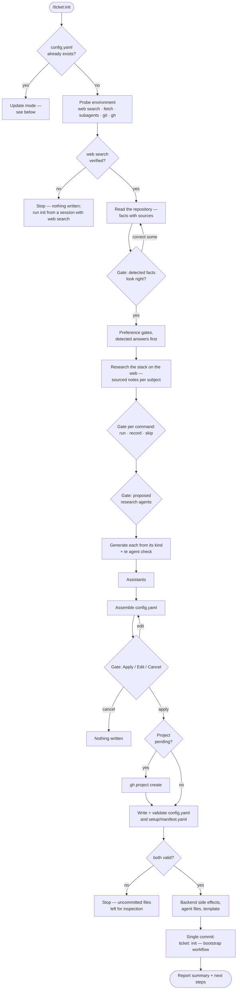

# `/ticket:init`

*Codex: `$ticket-init` · Antigravity / Gemini CLI / Copilot: `/ticket-init`*

Bootstrap — and, re-run, update. Probes what the session can do, reads the repository, asks
only what the repository can't answer, then generates `config.yaml` and applies
its side effects (stage folders + ledger, or GitHub labels/Project fields), sets
up research agents, and writes a starter ticket template — plus a **setup
manifest** recording where every value came from.

**Two modes.** With no `config.yaml`, init bootstraps the project. With one, it
enters **update mode** (below) — it never runs a fresh init over an existing
config.

## How it is laid out

The skill is a **spine** of phases, each ending in a gate. The substance of
each phase lives in a reference file under `references/init/` that is read only
when the phase starts, so the skill stays small and each phase stays focused.

| Phase | Reference | What it settles |
| --- | --- | --- |
| 0 — Orient | `environment.md` | Picks the mode (an existing config → update mode); probes web search, web fetch, subagents, git, gh — each `verified` or `unavailable`, never assumed. **No web search, no init:** a fresh init stops and redirects, writing nothing |
| 1 — Discover | `discovery.md` | Languages, frameworks, runtimes, datastores, CI, candidate test/lint/build commands, docs to reference, existing agents and assistant footprints — each with its source; confirmed in one gate |
| 2 — Interview | `interview.md`, `github-project.md` | Preferences only: backend, prefix, inbox, milestones, Project board, NFR profile, branch workflow — a detected fact leads each gate as the recommended answer |
| 3 — Research | `research.md` | The stack at its locked versions, researched on the web — pitfalls, idioms, security, testing, tooling — one sourced notes file per subject |
| 4 — Verification commands | `verification-commands.md` | Each candidate test/lint/typecheck/build command: run it now (with consent), record it unverified, or skip it |
| 5 — Design the agents | `generation.md`, `agents/anatomy.md`, `agents/kinds/` | The research-agent set, designed for this project (one per source); the six workflow agents regenerated for the stack; advisors/checkers only with a reason — all generated from kinds and checked with `te agent check` |
| 6 — Assistants | `assistants.md` | Which assistants work in the repo |
| 7 — Assemble | `config.md` | The config, previewed, behind an Apply / Edit / Cancel gate |
| 8 — Apply | `apply.md`, `manifest.md` | Config + manifest written and validated, side effects, agent files, template, one commit |
| 9 — Report | — | What was set up and what to do next |

## Flow

```mermaid
flowchart TD
    Start(["/ticket:init"]) --> Guard{"config.yaml<br/>already exists?"}
    Guard -->|yes| Update["Update mode —<br/>see below"]
    Guard -->|no| Probe["Probe environment<br/>web search · fetch · subagents · git · gh"]
    Probe --> Web{"web search<br/>verified?"}
    Web -->|no| Redirect["Stop — nothing written;<br/>run init from a session with web search"]
    Web -->|yes| Discover["Read the repository —<br/>facts with sources"]
    Discover --> Confirm{"Gate: detected facts<br/>look right?"}
    Confirm -->|correct some| Discover
    Confirm -->|yes| Interview["Preference gates,<br/>detected answers first"]
    Interview --> StackResearch["Research the stack on the web —<br/>sourced notes per subject"]
    StackResearch --> Cmds{"Gate per command:<br/>run · record · skip"}
    Cmds --> Research{"Gate: proposed<br/>research agents"}
    Research --> Gen["Generate each from its kind<br/>+ te agent check"]
    Gen --> Assist["Assistants"]
    Assist --> Assemble["Assemble config.yaml"]
    Assemble --> G9g{"Gate: Apply / Edit / Cancel"}
    G9g -->|edit| Assemble
    G9g -->|cancel| Cancelled["Nothing written"]
    G9g -->|apply| CreateProject{"Project<br/>pending?"}
    CreateProject -->|yes| DoCreateProject["gh project create"]
    DoCreateProject --> Apply
    CreateProject -->|no| Apply["Write + validate config.yaml<br/>and setup/manifest.yaml"]
    Apply --> Valid{"both valid?"}
    Valid -->|no| AbortInvalid["Stop — uncommitted files<br/>left for inspection"]
    Valid -->|yes| SideEffects["Backend side effects,<br/>agent files, template"]
    SideEffects --> Commit["Single commit:<br/>ticket: init — bootstrap workflow"]
    Commit --> Report(["Report summary + next steps"])
```

## The setup manifest

`setup/manifest.yaml` sits beside `config.yaml` and is committed with it. It
records the environment probe, every detected fact with the file it came from,
and every decision with its **provenance** — `asked` (the user chose),
`detected` (read from the repository and confirmed), or `default` (the user
skipped and the recommended option was taken). It is machine-owned and
validated by `te manifest validate`; a reader can always tell which choices were
deliberate.

## Generated agents

Every agent init writes follows one anatomy (`references/agents/anatomy.md`):
frontmatter, an `agent-kind` marker, **contract regions** copied verbatim from
the kind (what the agent is given, what it must return, what it may never do),
**generated regions** written for this project (role, source, method, and the
researched knowledge with its sources), and a **user region** init never
rewrites. `te agent check` enforces the anatomy and prints a hash per region;
the manifest records them.

That covers the **six workflow agents** too: the bundle ships their default
renderings, and init regenerates each one's role, project focus and researched
knowledge for your stack — their contracts never change. Where the research
gives a concrete reason, init also proposes a project **advisor** (advisory,
at the Plan gate and/or every loop round) or **checker** (blocking, e.g. one
that enforces an `nfr.budgets` entry). `/ticket:new` and `/ticket:pick` check
every agent reply with `te agent reply-check` before using it.

## Update mode

Re-run init on an initialised project and it updates instead of bootstrapping
(`references/init/update.md`):

1. **Load** the config and manifest. A project initialised before manifests
   existed is **adopted**: its config values become `asked` decisions, and old
   template-catalog research agents can be converted to generated ones.
2. **Orient again.** Without web search, update still runs everything that
   doesn't need it and lists the rest as *pending*.
3. **Find what changed** — re-detected facts vs the manifest, config values
   edited by hand (adopted, never reverted), research older than six months or
   behind a version bump, `te agent drift` (missing agents, contracts gone stale
   after a bundle upgrade, regions the project edited), new sources that
   deserve an agent, commands whose source changed.
4. **One plan, one gate** — Apply all / Choose / Cancel.
5. **Execute** — re-research, re-check commands, regenerate agents region by
   region: untouched regions are regenerated, **edited regions go through a
   three-way gate** (last generated · yours · regenerated → merge / keep /
   take), user regions are never touched.
6. **One commit** — `ticket: init — update (…)`.

## Reads / writes

- **Writes:** `config.yaml` (including the optional `nfr:` profile, `references:` filled from confirmed facts, and `verification:` from the commands the user kept), `setup/manifest.yaml`, `setup/research/<subject>.md` per researched subject, stage folders + `.gitkeep` (filesystem), `<root>/.ledger.yaml`, `<root>/TICKET_TEMPLATE.md`, `<agents-dir>/<name>.md` per generated research agent.
- **Branch workflow gate:** decides the `git:` block — `branch_workflow`, `merge_strategy`, and (github backend only) `pr_integration`. Defaults to branch-per-ticket enabled with a `--no-ff` merge and no PR integration.
- **GitHub side effects:** creates labels, verifies/creates issue-type map, creates the Project itself if none existed (before anything else in the apply step), verifies/creates Project fields (including a `Status` field seeded from the project's own stage labels, when one didn't already exist).

## Exit states

| Outcome | Result |
| --- | --- |
| Bootstrapped | Config + manifest written, side effects applied, single commit made |
| Updated | Plan applied, agents/research/config refreshed, manifest rewritten, single commit |
| Up to date | Update found nothing to change — no commit |
| No git repository | Stopped at the orient phase, nothing touched |
| No web search | Stopped at the orient phase, nothing touched — run init from a session with web search |
| Invalid config or manifest | Stopped after writing the files, left uncommitted for inspection |
| Cancelled at final gate | Nothing written |

## See also

- [Configuration reference](../config/reference.md) — the full shape of what gets written
- [Getting started § Step 0](../getting-started.md#step-0-research-agents) — thinking through research agents before you run this
