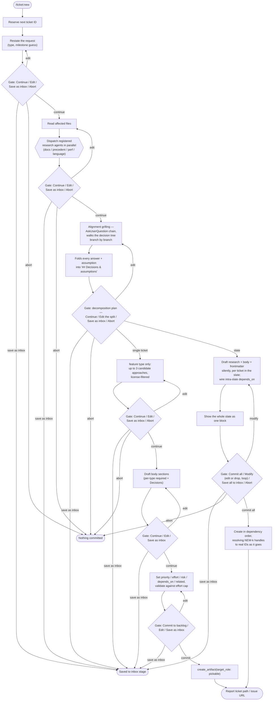

# `/ticket:new`

*Codex: `$ticket-new` · Antigravity / Gemini CLI / Copilot: `/ticket-new`*

The single entry point to capture work — one ticket, or a dependency-ordered
slate of several — with a mandatory alignment-interview pass before scope
locks in. See [Aligned by design](overview.md#aligned-by-design) for why that
pass exists.

**Precondition:** valid `config.yaml`; a description of the work, either as
`$ARGUMENTS` or given inline when asked.

## Flow

## Reads / writes

- **Reads:** affected source files; registered research agents (parallel dispatch).
- **Writes:** `create_artifact` (filesystem: new ticket file + ledger entry, one commit per ticket; GitHub: `gh issue create` + labels + Project item), or `save_as_inbox` if diverted at any gate.

## Exit states

| Outcome | Result |
| --- | --- |
| Committed | Ticket(s) land in the pickable stage, ready for `/ticket:pick` |
| Saved to inbox | Requires a configured `inbox` role; resume later with `/ticket:refine` |
| Aborted | Nothing committed; any reserved slate IDs are not reclaimed |
| Slate partially modified | User drops or edits individual tickets before the single slate-wide commit gate |

## See also

- [`/ticket:refine`](refine.md) — resumes anything saved to inbox
- [Configuration reference § Types](../config/reference.md#types) — per-type required body sections and the effort cap
