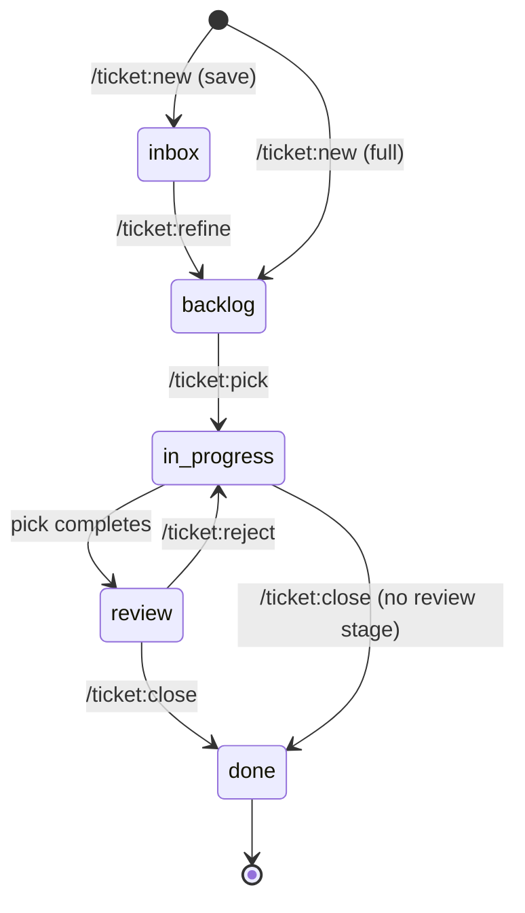

# Workflow overview

A small, opinionated issue tracker that lives in your repo and runs through
seven commands. The same commands work whether tickets are **Markdown files
committed to the repo** (filesystem backend) or **GitHub issues** (github
backend) — the choice lives in `config.yaml`, and every command delegates the
actual reads, writes, and stage transitions to the [`ticket-engine`
skill](../skills/ticket-engine.md).

The two bundles are functionally identical; only the invocation syntax
differs. Every page on this site uses the Claude Code form (`/ticket:new`) in
prose — use this table to translate:

| Step | Claude Code | Codex | Antigravity · Gemini CLI · Copilot |
| --- | --- | --- | --- |
| Bootstrap | `/ticket:init` | `$ticket-init` | `/ticket-init` |
| Create | `/ticket:new` | `$ticket-new` | `/ticket-new` |
| Refine inbox | `/ticket:refine` | `$ticket-refine` | `/ticket-refine` |
| Implement | `/ticket:pick` | `$ticket-pick` | `/ticket-pick` |
| Verify | `/ticket:review` | `$ticket-review` | `/ticket-review` |
| Send back | `/ticket:reject` | `$ticket-reject` | `/ticket-reject` |
| Ship | `/ticket:close` | `$ticket-close` | `/ticket-close` |

## Stages and roles

Tickets move through configurable **stages** — e.g. inbox → backlog →
in-progress → review → done. Commands don't hard-code stage names; they
resolve **roles** (`inbox`, `pickable`, `in_progress`, `review`, `terminal`)
against whatever stages your `config.yaml` defines. `pickable`, `in_progress`,
and `terminal` are required; `inbox` and `review` are optional, and their
presence changes which commands are available and where flows exit:

- **No `inbox` role** → `/ticket:refine` is unavailable; `/ticket:new` always
  commits straight to backlog (no "save as inbox" option).
- **No `review` role** → `/ticket:pick` ends directly in `in_progress` instead
  of handing off to review; `/ticket:reject` is unavailable; `/ticket:close`
  closes from `in_progress`.

## The seven commands

| Command | What it does | Details |
| --- | --- | --- |
| `/ticket:init` | Bootstrap a project: write `config.yaml`, create stage folders or labels, set up research agents, lay down a starter ticket template. One-time. | [→](init.md) |
| `/ticket:new` | Create one ticket — or a dependency-ordered slate — through a gated flow that reconciles intent with the assistant's understanding before anything commits. | [→](new.md) |
| `/ticket:refine` | Resume a captured inbox entry: promote to backlog, fold into another ticket, or close as wontfix. | [→](refine.md) |
| `/ticket:pick` | Claim a backlog ticket and implement it through a bounded plan → implement → verify → evaluate loop, ending at review (or done, if no review stage). | [→](pick.md) |
| `/ticket:review` | Print a read-only verification guide for a ticket in review. | [→](review.md) |
| `/ticket:reject` | Send a ticket that failed verification back to in-progress, with the reason recorded. | [→](reject.md) |
| `/ticket:close` | Close a ticket as shipped, trusting you've already verified the work. | [→](close.md) |

## Shared conventions

- **Every command loads and validates `config.yaml` first**, via the
  [`ticket-engine` skill](../skills/ticket-engine.md). If no config exists,
  the command stops and tells you to run `/ticket:init`.
- **Every user-facing decision point is an explicit gate** — the
  `AskUserQuestion` tool, with 2-4 concrete options and a recommended default
  first. Nothing destructive happens between gates.
- **Ticket data lives native, not in frontmatter, on GitHub.** On the
  filesystem backend, ticket files keep self-describing YAML frontmatter,
  while graph data (`depends_on`, `related`, `milestone`) lives in a
  machine-owned ledger (`.ledger.yaml`) beside the stage folders. On the
  GitHub backend, issues carry **no frontmatter at all** — dependencies are
  native issue dependencies, the claim clock is the assignment event,
  priority/effort/risk live as Project board fields (or labels), and `type`
  maps to native org issue types where available.
- **Optional GitHub Project (v2) board linkage.** `/ticket:init` can link a
  project; from then on every ticket is added to it on creation with its
  `Status` field synced to the workflow stage. The issue itself stays the
  source of truth for stage — a failed board update never blocks a
  transition.

## Aligned by design

Ticket creation treats shared understanding as a first-class goal. After
analyzing the relevant code (and dispatching your [research
agents](../getting-started.md#step-0-research-agents)), `/ticket:new` runs an
**alignment-grilling pass** — walking the decision tree branch by branch,
answering what it can from the codebase and asking you only the questions
that genuinely change scope, type, acceptance criteria, or size. Every answer
(and every silent default) is recorded in a `## Decisions & assumptions`
section on the ticket, so whoever picks it up later sees the same reconciled
view you signed off on.
