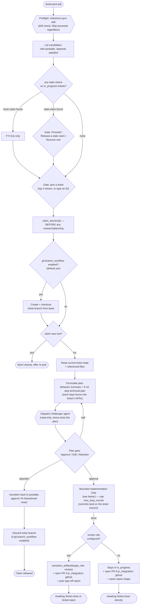
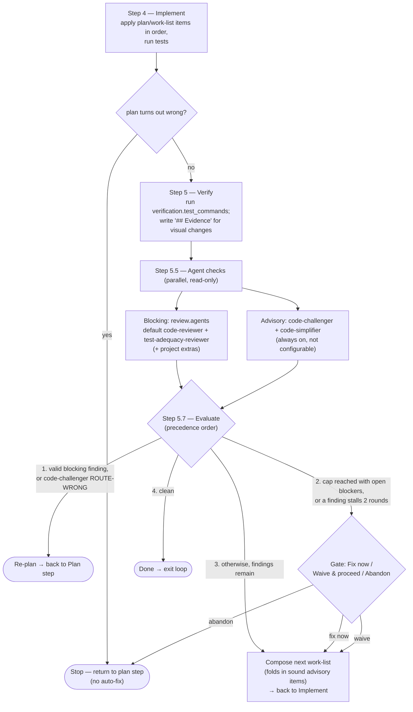

# `/ticket:pick`

*Codex: `$ticket-pick` · Antigravity / Gemini CLI / Copilot: `/ticket-pick`*

Claims a backlog ticket and implements it end-to-end through a bounded
**implement → verify → agent checks → evaluate** loop, ending at review (or
directly at done, if the project has no review stage).

**Precondition:** `pickable` and `in_progress` roles required; `review` role
optional — its presence changes step 6's exit point.

## Top-level flow

## The implementation loop

Every round: implement → verify → parallel agent checks → evaluate. The
evaluation has explicit precedence — a valid blocking finding always wins over
"keep iterating," and the round cap only bounds the *evaluate* decision, never
skips a check.

## Reads / writes

- **Claims:** `claim_atomic(id)` — happens before any research or planning; from this point, abandoning is an obligation, not an option skipped silently.
- **Reads:** `read_artifact`, referenced source files.
- **Writes:** `update_frontmatter` (rewrite stale body, record `## Evidence`), `transition_artifact` (to review, or back to pickable on abandon).
- **Branch:** when `git.branch_workflow: enabled` (default), creates `<branch_prefix><id>-<slug>` right after the claim and does all implementation work there; ticket-state commits still land on base. Opens a PR at the review/report point when `pr_integration: github`; discards the branch on abandon.
- **Agents dispatched:** [`challenger`](../agents/challenger.md) (plan stage), [`code-reviewer`](../agents/code-reviewer.md) + [`test-adequacy-reviewer`](../agents/test-adequacy-reviewer.md) (blocking, every round), [`code-challenger`](../agents/code-challenger.md) + [`code-simplifier`](../agents/code-simplifier.md) (advisory, every round). No NFR agent runs here: the ticket's [`## Non-functional requirements`](../agents/nfr-analyst.md) are passed to the checkers as acceptance criteria, so `code-reviewer` judges each against the diff and `test-adequacy-reviewer` fails the round if a requirement's test can't go red.

## Exit states

| Outcome | Result |
| --- | --- |
| In review | Awaiting `/ticket:review` / `/ticket:close` / `/ticket:reject` (project has a review stage) |
| In in_progress | Awaiting `/ticket:close` directly (no review stage configured) |
| Abandoned | Back in pickable, claim cleared, `## Abandoned notes` appended |
| Race lost | No state change; re-pick offered |

## See also

- [Review agents overview](../agents/index.md) — all five agents, their verdicts, and where each plugs into this loop
- [`milestone-sync` skill](../skills/milestone-sync.md) — the preflight this command runs first
