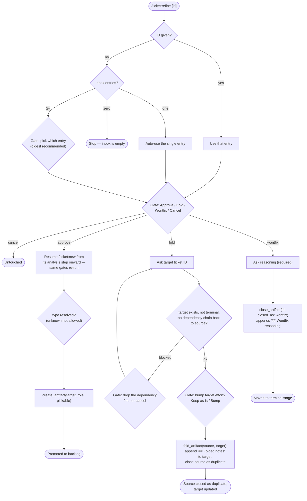

# `/ticket:refine`

*Codex: `$ticket-refine` · Antigravity / Gemini CLI / Copilot: `/ticket-refine`*

Resolves one inbox ticket to exactly one of three outcomes: promoted to
backlog, folded into another ticket, or closed as wontfix.

**Precondition:** a stage with the `inbox` role must be configured — otherwise
the command is unavailable.

## Flow

## Reads / writes

- **Reads:** `read_artifact`, `list_artifacts(role: inbox)`.
- **Writes:** `create_artifact` (approve path), `fold_artifact` (fold path), `close_artifact` (wontfix path).

## Exit states

| Outcome | Result |
| --- | --- |
| Promoted | Ticket lands in the pickable stage |
| Folded | Source closed as `duplicate`; target gets a `## Folded notes` section |
| Closed wontfix | Ticket moved to the terminal stage with reasoning recorded |
| Cancelled | Nothing changed |

## See also

- [`/ticket:new`](new.md) — the approve path resumes this flow from its analysis step
