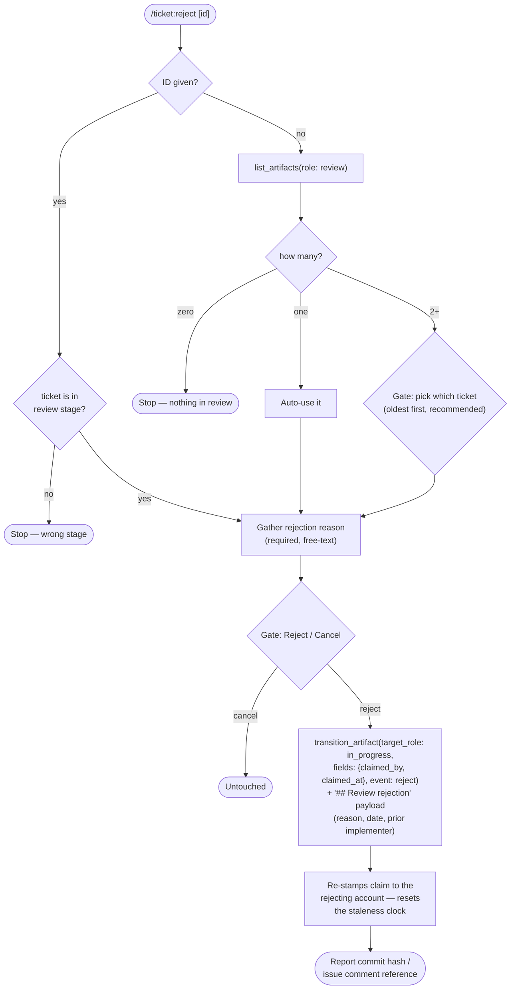

# `/ticket:reject`

*Codex: `$ticket-reject` · Antigravity / Gemini CLI / Copilot: `/ticket-reject`*

The counterpart to `/ticket:close` — sends a ticket that failed verification
back to `in_progress`, with the reason recorded on the ticket.

**Precondition:** the `review` role must be configured — otherwise the
command is unavailable.

## Flow

## Reads / writes

- **Reads:** `list_artifacts(role: review)`.
- **Writes:** `transition_artifact` — filesystem: commit `commits.reject`; GitHub: content-bearing comment + label swap + reassignment.

## Exit states

| Outcome | Result |
| --- | --- |
| Rejected | Ticket back in `in_progress`; fix-forward proceeds via `/ticket:pick`'s normal implementation steps (claim already held) |
| Cancelled | Nothing changed |
| Half-state | Surfaced and stopped if the transition partially fails |

## See also

- [`/ticket:pick`](pick.md) — where the fix-forward work happens next
- [`/ticket:review`](review.md) — the verification guide that usually precedes a reject
