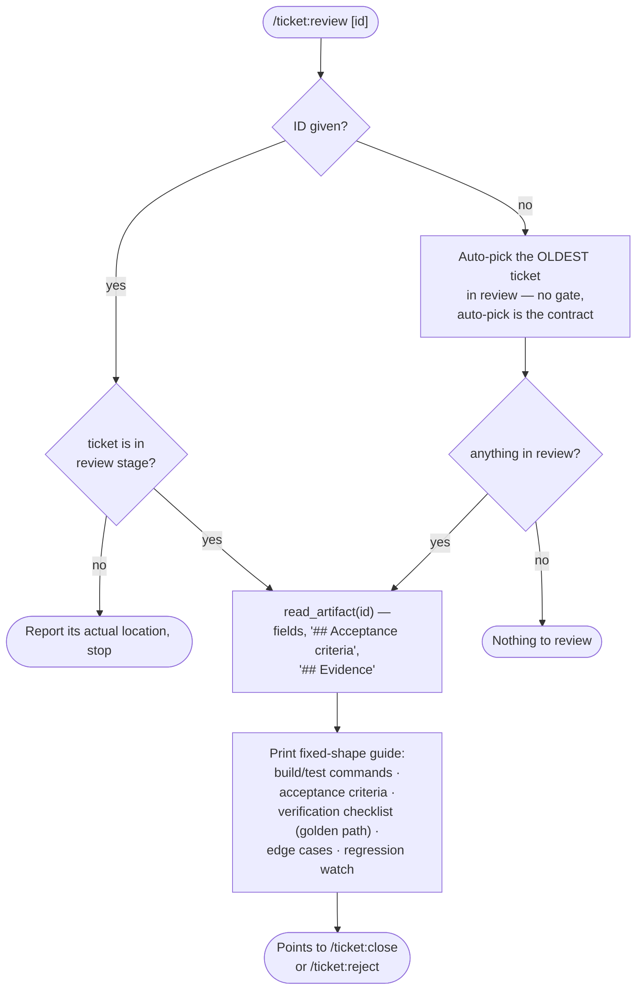

# `/ticket:review`

*Codex: `$ticket-review` · Antigravity / Gemini CLI / Copilot: `/ticket-review`*

Prints a read-only verification checklist for a ticket sitting in the review
stage. This command never mutates anything — it exists purely to hand you a
consistent, fixed-shape guide for manual verification.

**Precondition:** the `review` role must be configured — otherwise the
command is unavailable.

## Flow

## Reads / writes

- **Reads:** `read_artifact`, `list_artifacts` — nothing else.
- **Writes:** nothing. This command is pure output.

## Exit states

| Outcome | Result |
| --- | --- |
| Guide printed | Success — you verify manually, then close or reject |
| Command unavailable | No `review` role configured for this project |
| Nothing to review | Review stage is empty |
| Ticket elsewhere | Reports its actual stage, stops |

## See also

- [`/ticket:close`](close.md) — where you go once verification passes
- [`/ticket:reject`](reject.md) — where you go if it doesn't
