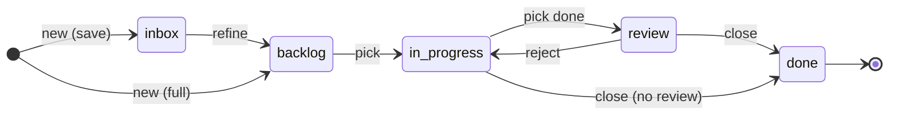
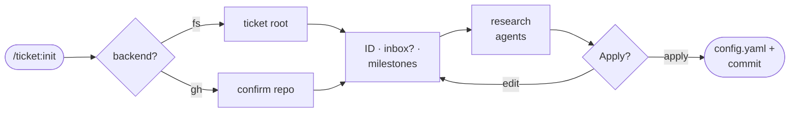
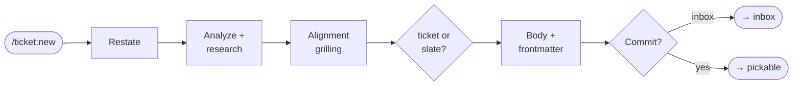
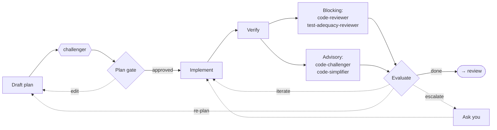
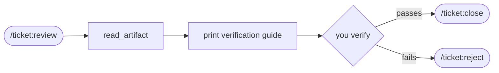

# agents-skills-setup

A backend-agnostic ticket workflow, wired into your coding assistant

Today: init · new / refine · pick · review — then we run it live

Moritz Ellerbrock

<!--
Welcome, framing: this is a template repo you copy into a project. Everything
is prompt-and-config — no runtime, no server, no build step for the workflow
itself (the docs site is a separate thing).
-->

---
layout: default
---

# What is this, really?

<v-clicks>

- A small **issue tracker that lives in your repo** — Markdown files or GitHub issues, your choice
- Driven entirely through **slash commands** your coding assistant runs
- Every command is **prompt-and-config only** — no runtime, no server, the assistant executes it with its own tools (Read, Edit, Bash, …)
- Ships with **review agents** that stress-test plans and diffs automatically
- **You approve every consequential step** — nothing commits without an explicit gate

</v-clicks>

Full docs: elmoritz.github.io/agents-skills-setup

<!--
Emphasize "prompt-and-config" — there's no hidden service. Everything you'll
see today is the assistant reading a Markdown instruction file and using its
normal tools. That's *why* it's copy-and-customize, not npm-install.
-->

---
layout: default
---

# The mental model: stages & roles

Tickets move through **stages** you configure (inbox → backlog → in-progress → review → done).
Commands never hardcode stage names — they resolve **roles**.

Roles: <code>inbox</code> (optional) · <code>pickable</code> · <code>in_progress</code> · <code>review</code> (optional) · <code>terminal</code>

<!--
This diagram is the spine of the whole talk. Every command we cover today is
one arrow (or one node) on this picture. Point back to it before each section.
-->

---
layout: default
---

# Today's roadmap

| Command | What it does |
| --- | --- |
| **`/ticket:init`** | Bootstrap: write `config.yaml`, create stages, set up research agents |
| **`/ticket:new`** | Capture work — reconciled with you before anything commits |
| **`/ticket:refine`** | Resolve a captured inbox entry: promote / fold / wontfix |
| **`/ticket:pick`** | Claim a ticket, plan it, implement it through to review |
| **`/ticket:review`** | Print a read-only verification guide |

Not today: <code>/ticket:reject</code> and <code>/ticket:close</code> — same idea, ask me after

And at the end: <strong>we run <code>/ticket:init</code> live.</strong>

---
layout: section
---

# `/ticket:init`

Bootstrap — one time, before anything else works

<!--
Section marker. Keep this fast — the point is "here's what we're about to
zoom into."
-->

---
layout: default
---

# init — what it actually sets up

**You answer, via gates:**

<v-clicks>

- Backend: filesystem or GitHub Issues
- Ticket root / repo confirmation
- ID prefix, inbox stage yes/no
- Milestones strategy
- GitHub Project board link (optional)
- **Research agents** for your project's sources
- Which assistants read this repo

</v-clicks>

**It writes, once approved:**

<v-clicks>

- `config.yaml`
- Stage folders + ledger (filesystem)
- Labels + Project fields (GitHub)
- Research agent files
- `TICKET_TEMPLATE.md`
- One commit: <code>ticket: init — bootstrap workflow</code>

</v-clicks>

<!--
Research agents is the one concept worth dwelling on: "any source that holds
information should be a research agent, not inline reading." That's the
design principle that makes ticket creation not flood the context window.
-->

---
layout: default
---

# init — the flow

Guardrail: refuses to run if <code>config.yaml</code> already exists — no accidental overwrite

---
layout: section
---

# `/ticket:new` & `/ticket:refine`

Capturing work — and closing the loop on anything half-captured

---
layout: default
---

# new — aligned by design

The core idea: <strong>shared understanding before anything commits.</strong>

<v-clicks>

- Reads the affected code, dispatches your **research agents** in parallel
- Runs an **alignment-grilling pass** — walks the decision tree branch by branch
- Asks you only what genuinely changes scope, type, acceptance criteria, or size
- Records every answer — and every silent default — in <code>## Decisions & assumptions</code>
- **Gate at every step**: Continue / Edit / Save as inbox / Abort

</v-clicks>

Too big for one ticket? It silently splits into a dependency-ordered slate, one gate for the whole set.

---
layout: default
---

# new — the flow

Every box above is really "step → gate" — this is the simplified version

---
layout: default
---

# refine — closing the loop on inbox

One inbox entry resolves to exactly **one** of three outcomes:

**Approve**

Resumes `/ticket:new` from its analysis step — same gates, ends in the backlog

**Fold**

Merges into an existing ticket — target gets `## Folded notes`, source closes as `duplicate`

**Wontfix**

Closed with required reasoning recorded on the ticket

Zero, one, or several entries waiting — refine auto-picks when there's exactly one

---
layout: section
---

# `/ticket:pick`

Claim it, plan it, implement it — with review agents in the loop

---
layout: default
---

# pick — claim, then plan

<v-clicks>

- Surfaces candidates from the backlog, sorted by priority and effort
- **Claims atomically before any research or planning** — from here, abandoning is an obligation, not something skipped silently
- Drafts a plan: behavior summary + a 5–10 step technical plan
- The **`challenger`** agent stress-tests it — concrete failure scenarios, cheaper routes, never vague doubt
- **Plan gate**: Approve / Edit / Abandon — you judge the plan *and* the challenge together

</v-clicks>

Only after approval does any code get touched

---
layout: default
---

# pick — the implementation loop

Blocking checkers are <strong>configurable</strong> (<code>review.agents</code>, default shown) — advisory checkers are <strong>fixed</strong>, always on. Bounded by a round cap (default 3).

<!--
This is the hero diagram of the whole talk — give it real time. Walk the
happy path first (left to right, done), then the two escape hatches
(re-plan, escalate). All five review agents are named on this one slide —
call out the blocking/advisory split explicitly: blocking checkers are
config's review.agents (a project could swap in different ones), advisory
checkers (code-challenger, code-simplifier) are hardcoded into pick, always
run, never configurable. A blocking finding beats advisory every time in
the evaluate step.
-->

---
layout: section
---

# `/ticket:review`

The read-only guide before you close or reject

---
layout: default
---

# review — one job, does it well

<v-clicks>

- Picks the ticket in review — by ID, or the **oldest** one automatically
- **Reads only** — `read_artifact`, nothing else. Never mutates anything.
- Prints a fixed-shape guide: build/test commands, acceptance criteria, a golden-path checklist, edge cases, regression watch
- You verify manually, then decide

</v-clicks>

---
layout: default
---

# Putting it back together

We covered <strong>init</strong> (sets it up), <strong>new / refine</strong> (backlog → inbox), <strong>pick</strong> (backlog → review), <strong>review</strong> (the checkpoint before close/reject)

---
layout: statement
---

# Let's run `/ticket:init` — live

Watch the gates fire one at a time — nothing commits until the last one

<!--
DEMO RUNBOOK — have this open on a second screen, not projected.

Before the talk:
- Have a throwaway git repo ready (empty or near-empty), already `git init`'d,
  clean working tree. Don't run this in a repo you care about — init writes
  config.yaml + a commit.
- Decide your answers ahead of time so you're not improvising live:
  backend (filesystem is simplest to demo, no gh auth needed),
  ticket root folder name, ID prefix, inbox yes/no, milestones strategy.
  Filesystem + no GitHub project + labels-or-none milestones is the fastest
  demo path with the fewest gates.
- Know what you'll say for "research agents" — even a single custom one
  ("read our internal wiki") makes the point without derailing into the full
  catalog. Or skip registering any and say so explicitly.

During the demo:
1. Type /ticket:init and narrate each gate as it appears — call back to the
   init flow diagram from a few slides ago.
2. Let the audience see the assembled config.yaml at the final Apply/Edit/
   Cancel gate before you approve it — that's the "nothing commits without
   sign-off" moment landing for real.
3. After it applies: show the single commit (`git log -1`) and the stage
   folders it created.

Fallback if something breaks (network, gh auth, a typo): have a terminal
recording or screenshots of a prior clean run ready as backup, and say so
plainly rather than debugging live.
-->

---
layout: end
---

# Thank you

Full docs — elmoritz.github.io/agents-skills-setup

Repo — github.com/elmoritz/agents-skills-setup

